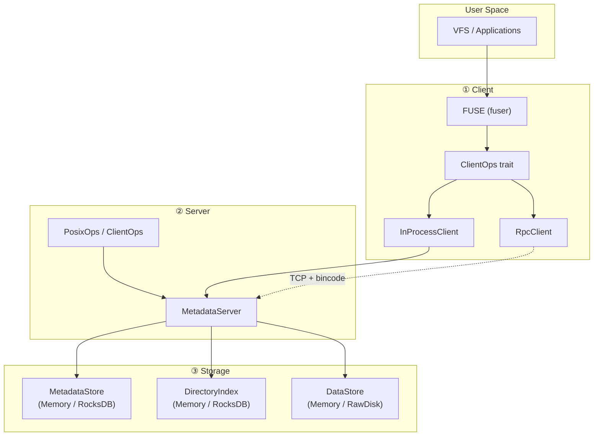

# RucksFS

A modular, trait-based user-space file system built in Rust. RucksFS separates concerns into **Client**, **Server**, and **Storage** layers, connected through trait abstractions for easy extension and backend swapping.

---

## Features

- **Full POSIX semantics**: `mkdir`, `create`, `read`, `write`, `rename`, `unlink`, `rmdir`, `readdir`, `getattr`, `setattr`, `statfs`
- **Pluggable storage**: In-memory (default) or persistent (RocksDB + RawDisk) via feature flags
- **FUSE mount**: Mount as a real filesystem on Linux
- **RPC mode**: Client/Server over TCP with bincode serialization
- **Single-binary demo**: Embed client + server in one process for quick exploration

---

## Architecture

```
┌────────────────────────────────────┐
│           rucksfs-demo             │
│  (CLI: auto / interactive / FUSE)  │
├────────────┬───────────────────────┤
│ rucksfs-   │    rucksfs-server     │
│ client     │  (MetadataServer:     │
│            │   PosixOps+ClientOps) │
├────────────┴───────────────────────┤
│         rucksfs-storage            │
│  ┌────────────┐  ┌──────────────┐  │
│  │ Memory     │  │ RocksDB      │  │
│  │ (default)  │  │ (--persist)  │  │
│  └────────────┘  └──────────────┘  │
├────────────────────────────────────┤
│           rucksfs-core             │
│  (ClientOps, PosixOps, types)      │
└────────────────────────────────────┘
```



---

## Crate Overview

| Crate | Description |
|---|---|
| **core** | Shared types (`FileAttr`, `DirEntry`, `StatFs`, `FsError`) and trait definitions (`PosixOps`, `ClientOps`) |
| **storage** | Storage trait abstractions (`MetadataStore`, `DataStore`, `DirectoryIndex`) with Memory and RocksDB backends |
| **server** | `MetadataServer` — POSIX semantics engine; depends only on storage traits |
| **client** | `InProcessClient`, FUSE adapter (`FuseClient`), `build_client`, `mount_fuse` |
| **rpc** | TCP RPC layer: `RpcClientOps` (client) + `serve(addr, backend)` (server), bincode serialization |
| **demo** | Single-binary demo with three modes: auto-demo, interactive REPL, FUSE mount |

---

## Quick Start

```bash
# Clone and build
git clone https://github.com/csjgg/rucksfs.git
cd rucksfs

# Run the automatic demo (in-memory, no extra deps)
cargo run -p rucksfs-demo

# Interactive REPL mode
cargo run -p rucksfs-demo -- --interactive

# Persistent storage (RocksDB)
cargo run -p rucksfs-demo --features rocksdb -- --persist /tmp/rucksfs-data
```

### RPC Mode (Client + Server in Separate Processes)

```bash
# Terminal 1: start the server
cargo run -p rucksfs-server -- --bind 127.0.0.1:9000

# Terminal 2: connect the client and mount via FUSE
cargo run -p rucksfs-client -- --server 127.0.0.1:9000 --mount /tmp/rucksfs
```

### FUSE Mount via Demo (Linux Only)

```bash
cargo run -p rucksfs-demo -- --mount /mnt/rucksfs
```

---

## Running Tests

```bash
# All workspace tests
cargo test --workspace

# Demo integration tests only
cargo test -p rucksfs-demo

# Include RocksDB persistence tests
cargo test -p rucksfs-demo --features rocksdb
```

---

## Documentation

- [Demo Guide](docs/demo-guide.md) — detailed walkthrough of all demo modes
- [Deployment Guide](docs/deployment.md) — production deployment instructions
- [Design Document](docs/design.md) — architecture and design decisions

---

## TODO

- [ ] Verify correctness, feasibility, and thread-safety of the current architecture
- [ ] Introduce IndexNode on the server side to reduce RocksDB query frequency
- [ ] Introduce Delta Record to speed up file attribute modification writes
- [ ] Introduce client-side caching to reduce round-trips to server
- [ ] Evaluate replacing FUSE with a kernel module
  - [ ] Research feasibility and trade-offs of kernel module approach
  - [ ] Survey common approaches used by current cluster/distributed file systems (CFS)

---

## License

MIT
