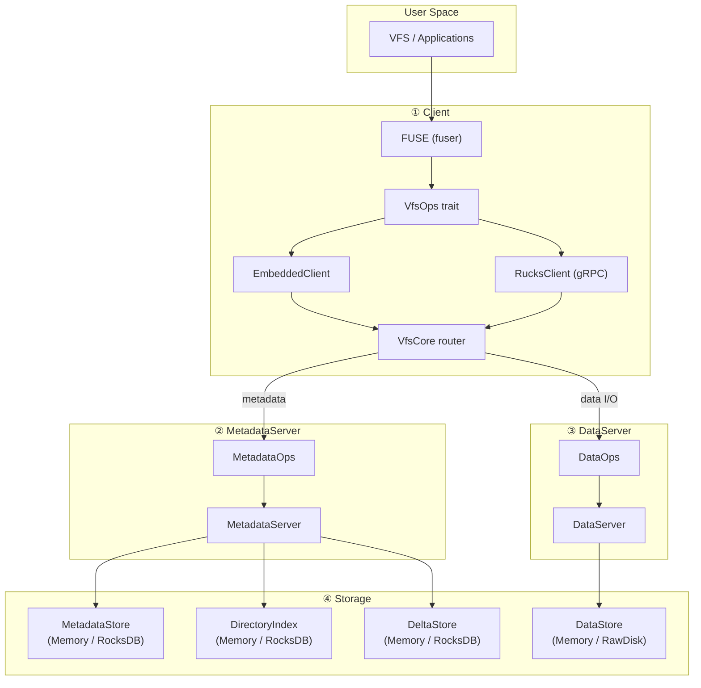

# RucksFS

A modular, trait-based user-space file system built in Rust. Inspired by JuiceFS, RucksFS cleanly separates **metadata** and **data** paths: the MetadataServer manages the namespace, and the DataServer stores file contents. Clients route operations through a thin VFS layer.

---

## Features

- **Full POSIX semantics**: `mkdir`, `create`, `read`, `write`, `rename`, `unlink`, `rmdir`, `readdir`, `getattr`, `setattr`, `statfs`, `flush`, `fsync`
- **Metadata / Data split**: MetadataServer handles namespace and attributes; DataServer handles file I/O
- **Pluggable storage**: In-memory (default) or persistent (RocksDB + RawDisk) via feature flags
- **Delta-based metadata updates**: Append-only deltas with background compaction for high write throughput
- **FUSE mount**: Mount as a real filesystem on Linux
- **gRPC RPC**: MetadataService and DataService defined in Protocol Buffers
- **Single-binary demo**: Embed MetadataServer + DataServer + EmbeddedClient in one process

---

## Architecture

```
┌──────────────────────────────────────────────────────┐
│                   rucksfs-demo                       │
│  (CLI: auto-demo / interactive REPL / FUSE mount)    │
├──────────────────────────────────────────────────────┤
│           rucksfs-client                             │
│  ┌──────────────────┐  ┌──────────────────────────┐  │
│  │ EmbeddedClient   │  │ RucksClient (gRPC)       │  │
│  │ (in-process)     │  │ (network, planned)       │  │
│  └────────┬─────────┘  └────────┬─────────────────┘  │
│           └─────────┬───────────┘                    │
│                VfsCore (routing)                     │
│           ┌─────────┴───────────┐                    │
│    MetadataOps              DataOps                  │
├──────────────────┬───────────────────────────────────┤
│ rucksfs-server   │         rucksfs-dataserver        │
│ (MetadataServer) │         (DataServer<D>)           │
├──────────────────┴───────────────────────────────────┤
│                  rucksfs-storage                     │
│  ┌─────────────────┐  ┌──────────────────────────┐   │
│  │ MetadataStore   │  │ DataStore                │   │
│  │ DirectoryIndex  │  │ (Memory / RawDisk)       │   │
│  │ DeltaStore      │  └──────────────────────────┘   │
│  │ (Memory/Rocks)  │                                 │
│  └─────────────────┘                                 │
├──────────────────────────────────────────────────────┤
│                   rucksfs-core                       │
│  (MetadataOps, DataOps, VfsOps, types)               │
└──────────────────────────────────────────────────────┘
```



---

## Crate Overview

| Crate | Description |
|---|---|
| **core** | Shared types (`FileAttr`, `DirEntry`, `StatFs`, `FsError`, `SetAttrRequest`, `OpenResponse`, `DataLocation`) and trait definitions (`MetadataOps`, `DataOps`, `VfsOps`) |
| **storage** | Storage trait abstractions (`MetadataStore`, `DataStore`, `DirectoryIndex`, `DeltaStore`) with Memory and RocksDB/RawDisk backends |
| **server** | `MetadataServer` — namespace & attribute engine, delegates data I/O to DataServer via `Arc<dyn DataOps>` |
| **dataserver** | `DataServer<D: DataStore>` — file data I/O engine, implements `DataOps` |
| **client** | `VfsCore` (routing), `EmbeddedClient` (in-process), FUSE adapter (`FuseClient`), `mount_fuse` |
| **rpc** | gRPC layer: `MetadataRpcServer/Client` + `DataRpcServer/Client` with Protocol Buffers |
| **demo** | Single-binary demo with three modes: auto-demo, interactive REPL, FUSE mount |

---

## Quick Start

```bash
# Clone and build
git clone https://github.com/csjgg/rucksfs.git
cd rucksfs

# Run the automatic demo (in-memory, no extra deps)
cargo run -p rucksfs-demo

# Interactive REPL mode
cargo run -p rucksfs-demo -- --interactive

# Persistent storage (RocksDB)
cargo run -p rucksfs-demo --features rocksdb -- --persist /tmp/rucksfs-data
```

### FUSE Mount via Demo (Linux Only)

```bash
cargo run -p rucksfs-demo -- --mount /mnt/rucksfs
```

---

## Running Tests

```bash
# All workspace tests (171+ tests)
cargo test --workspace

# Demo integration tests only
cargo test -p rucksfs-demo

# DataServer unit tests
cargo test -p rucksfs-dataserver

# Server integration tests
cargo test -p rucksfs-server

# Include RocksDB persistence tests
cargo test -p rucksfs-demo --features rocksdb
```

---

## Data Flow

1. **Metadata path**: Client → `VfsCore` → `MetadataOps` → `MetadataServer` → `MetadataStore` + `DirectoryIndex` + `DeltaStore`
2. **Data path**: Client → `VfsCore` → `DataOps` → `DataServer` → `DataStore`
3. **Write flow**: Client writes data directly to DataServer, then calls `MetadataServer::report_write()` to update file size/mtime
4. **Open flow**: `MetadataServer::open()` returns an `OpenResponse` containing the `DataLocation` (address of the DataServer to talk to)

---

## TODO

- [ ] Implement `RucksClient` — network client using gRPC (MetadataRpcClient + DataRpcClient)
- [ ] Restore standalone server/client binaries with gRPC transport
- [ ] Evaluate TiKV-compatible metadata backend (for distributed metadata)
- [ ] Client-side read/write caching to reduce round-trips
- [ ] Multi-DataServer support with chunk-level placement
- [ ] Evaluate replacing FUSE with a kernel module

---

## License

MIT
