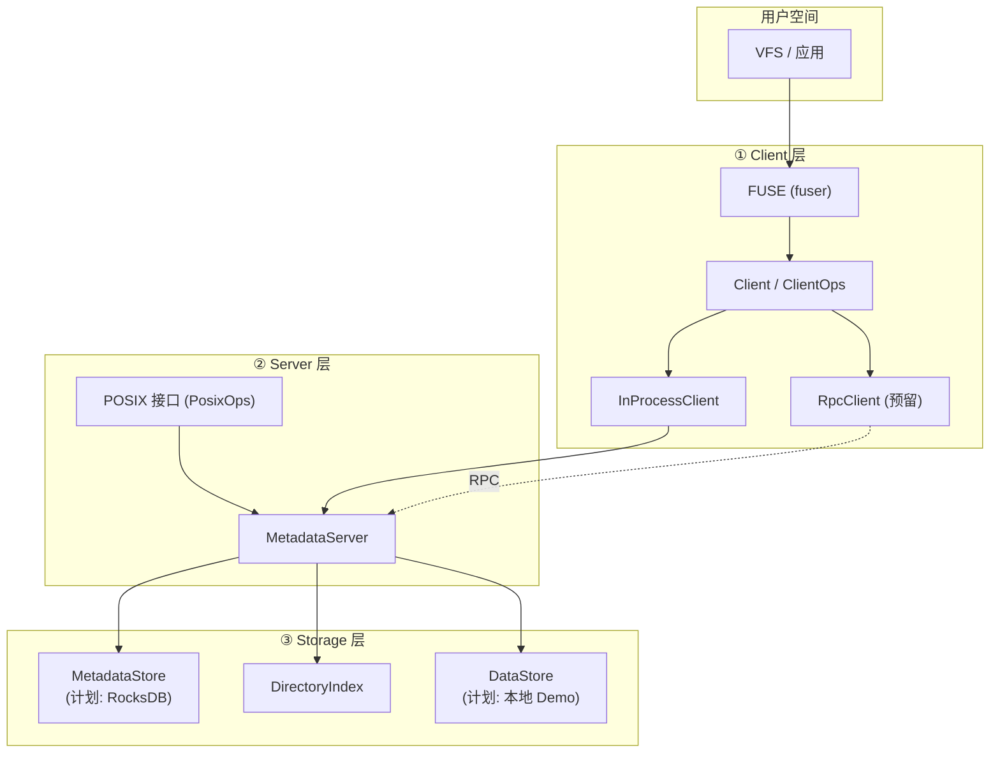

# rucksfs

RucksFS：元数据管理（FUSE + RocksDB）工程骨架。整体分为 **Client**、**Server**、**Storage** 三部分，通过 trait 抽象解耦，便于后期扩展与替换实现。

---

## 架构概览

```ini
                    ┌─────────────────────────────────────────┐
                    │            用户空间 / 应用                │
                    │         (ls, cat, vim, ...)             │
                    └────────────────────┬────────────────────┘
                                          │ VFS
                                          ▼
┌─────────────────────────────────────────────────────────────────────────────┐
│  ① CLIENT 层                                                                │
│  ┌─────────────────────────────────────────────────────────────────────┐   │
│  │  FUSE 接口 (fuser)  ←→  Client 抽象 (Client / ClientOps)             │   │
│  │  • 进程内: InProcessClient → 直接调用 Server（Demo 用）               │   │
│  │  • 远程:   RpcClientOps → 通过 RPC 请求 Server（TCP + bincode）        │   │
│  └─────────────────────────────────────────────────────────────────────┘   │
└─────────────────────────────────────────────────────────────────────────────┘
                                          │
                               RPC 或 进程内调用 (ClientOps)
                                          ▼
┌─────────────────────────────────────────────────────────────────────────────┐
│  ② SERVER 层（核心）                                                         │
│  ┌─────────────────────────────────────────────────────────────────────┐   │
│  │  POSIX 语义 (PosixOps / ClientOps)                                   │   │
│  │  MetadataServer：lookup, getattr, readdir, read, write, create, ...  │   │
│  │  仅依赖 Storage 的 trait，不绑定具体实现                              │   │
│  └─────────────────────────────────────────────────────────────────────┘   │
└─────────────────────────────────────────────────────────────────────────────┘
                                          │
                              调用 Storage 抽象 (trait)
                    ┌─────────────────────┼─────────────────────┐
                    ▼                     ▼                     ▼
┌─────────────────────────────┐ ┌─────────────────────────────┐ ┌─────────────────────────────┐
│  ③ STORAGE 层               │ │  ③ STORAGE 层               │ │  ③ STORAGE 层               │
│  元数据存储                  │ │  目录索引                   │ │  文件数据块存储              │
│  MetadataStore              │ │  DirectoryIndex            │ │  DataStore                  │
│  • 计划: RocksDB             │ │  • 可基于 MetadataStore    │ │  • 计划: 本地存储 Demo       │
└─────────────────────────────┘ └─────────────────────────────┘ └─────────────────────────────┘
```

- **① Client**：与操作系统挂载（FUSE），将文件操作转为对 Server 的请求（进程内或 RPC）。
- **② Server**：实现 POSIX 语义与元数据管理，只依赖 Storage 的 trait。
- **③ Storage**：元数据（RocksDB）与文件数据块（本地 Demo）分离，均通过 trait 抽象，便于替换与扩展。

---

## 架构图（Mermaid）



---

## 目录与模块说明

| 目录 / crate | 职责 |
|-------------|------|
| __core__ | 公共类型（`FileAttr`, `DirEntry`, `StatFs`, `FsError`）、POSIX 接口定义（`PosixOps` 同步 / `ClientOps` 异步） |
| __storage__ | 存储抽象：`MetadataStore`（KV）、`DataStore`（文件块）、`DirectoryIndex`（目录解析），无具体后端绑定 |
| __server__ | 元数据服务核心：`MetadataServer` 实现 `PosixOps`/`ClientOps`，组合上述三个 Storage trait |
| __client__ | FUSE 客户端：`Client` trait、`InProcessClient`（进程内）、`FuseClient`（fuser 实现）、`build_client`、`mount_fuse`；可单独编译为 `rucksfs-client` 二进制（RPC 连接 + 挂载） |
| __rpc__ | RPC：`RpcClientOps`（实现 `ClientOps`）、`serve(addr, backend)`（Tokio 异步 TCP），请求/响应 bincode 序列化 |
| __demo__ | 单二进制 Demo：Client + Server 编译在一起，可挂载到本地目录，用于演示（具体挂载逻辑可后续实现） |

---

## 设计要点

1. **三部分解耦**：Client 只依赖 `ClientOps`；Server 只依赖 `MetadataStore`、`DataStore`、`DirectoryIndex`；Storage 仅提供 trait，实现可插拔（RocksDB、本地文件等）。
2. **元数据与数据分离**：元数据走 `MetadataStore`（计划 RocksDB），文件内容走 `DataStore`（计划本地小 Demo），便于独立演进与扩展。
3. **Demo 单二进制**：`demo` 将 Client 与 Server 编进同一可执行文件，不区分进程，直接挂载即可做演示；后续可再接入 RPC 拆成多进程部署。

---

## 构建与运行

```bash
# 检查与构建
cargo check
cargo build -p rucksfs-client   # 单独 Client 二进制
cargo build -p rucksfs-server   # 单独 Server 二进制
cargo build -p rucksfs-demo    # 合编 Demo 二进制
```

**RPC 模式**（Client 与 Server 分进程，通过 TCP RPC 通信）：

```bash
# 终端 1：启动 Server
cargo run -p rucksfs-server -- --bind 127.0.0.1:9000

# 终端 2：连接并挂载 Client（需系统权限）
cargo run -p rucksfs-client -- --server 127.0.0.1:9000 --mount /tmp/rucksfs
```

**Demo 合编**（单进程，进程内调用，无 RPC；需要系统权限，当前为占位逻辑）：

```bash
cargo run -p rucksfs-demo -- --mount
```

---

## License

MIT
