# 元数据 KV 存储技术调研与项目发展方向分析

> **文档版本：** 1.0.0-draft
> **最后更新：** 2026-02-12
> **面向读者：** RucksFS 项目开发者 / 文件系统研究者

---

## 目录

- [元数据 KV 存储技术调研与项目发展方向分析](#元数据-kv-存储技术调研与项目发展方向分析)
  - [目录](#目录)
  - [1. 引言与背景](#1-引言与背景)
    - [1.1 为什么需要这份调研](#11-为什么需要这份调研)
    - [1.2 RucksFS 项目现状概述](#12-rucksfs-项目现状概述)
      - [架构总览](#架构总览)
      - [关键设计决策](#关键设计决策)
      - [RocksDB Column Family Schema](#rocksdb-column-family-schema)
      - [当前架构的特征定位](#当前架构的特征定位)
    - [1.3 调研范围与方法论](#13-调研范围与方法论)
  - [2. 系统深度分析](#2-系统深度分析)
    - [2.1 早期学术探索](#21-早期学术探索)
      - [2.1.1 TableFS (2013)](#211-tablefs-2013)
        - [架构概览](#架构概览)
        - [(a) 元数据 KV 存储实现方式](#a-元数据-kv-存储实现方式)
        - [(b) 解决的核心问题](#b-解决的核心问题)
        - [(c) 架构类型](#c-架构类型)
        - [(d) 主要应用领域](#d-主要应用领域)
        - [(e) 缺点与不足](#e-缺点与不足)
        - [(f) 元数据与数据存储的协作方式](#f-元数据与数据存储的协作方式)
        - [(g) 性能影响分析](#g-性能影响分析)
      - [2.1.2 IndexFS (2014/2015)](#212-indexfs-20142015)
        - [架构概览](#架构概览-1)
        - [(a) 元数据 KV 存储实现方式](#a-元数据-kv-存储实现方式-1)
        - [(b) 解决的核心问题](#b-解决的核心问题-1)
        - [(c) 架构类型](#c-架构类型-1)
        - [(d) 主要应用领域](#d-主要应用领域-1)
        - [(e) 缺点与不足](#e-缺点与不足-1)
        - [(f) 元数据与数据存储的协作方式](#f-元数据与数据存储的协作方式-1)
        - [(g) 性能影响分析](#g-性能影响分析-1)
      - [2.1.3 LocoFS (2017)](#213-locofs-2017)
        - [架构概览](#架构概览-2)
        - [(a) 元数据 KV 存储实现方式](#a-元数据-kv-存储实现方式-2)
        - [(b) 解决的核心问题](#b-解决的核心问题-2)
        - [(c) 架构类型](#c-架构类型-2)
        - [(d) 主要应用领域](#d-主要应用领域-2)
        - [(e) 缺点与不足](#e-缺点与不足-2)
        - [(f) 元数据与数据存储的协作方式](#f-元数据与数据存储的协作方式-2)
        - [(g) 性能影响分析](#g-性能影响分析-2)
    - [2.2 面向对象存储 \& 云原生层级命名空间](#22-面向对象存储--云原生层级命名空间)
      - [2.2.1 S3/COS 对象存储](#221-s3cos-对象存储)
        - [架构概览](#架构概览-3)
        - [(a) 元数据 KV 存储实现方式](#a-元数据-kv-存储实现方式-3)
        - [(b) 解决的核心问题](#b-解决的核心问题-3)
        - [(c) 架构类型](#c-架构类型-3)
        - [(d) 主要应用领域](#d-主要应用领域-3)
        - [(e) 缺点与不足](#e-缺点与不足-3)
        - [(f) 元数据与数据存储的协作方式](#f-元数据与数据存储的协作方式-3)
        - [(g) 性能影响分析](#g-性能影响分析-3)
      - [2.2.2 百度沧海 TafDB](#222-百度沧海-tafdb)
        - [架构概览](#架构概览-4)
        - [(a) 元数据 KV 存储实现方式](#a-元数据-kv-存储实现方式-4)
        - [(b) 解决的核心问题](#b-解决的核心问题-4)
        - [(c) 架构类型](#c-架构类型-4)
        - [(d) 主要应用领域](#d-主要应用领域-4)
        - [(e) 缺点与不足](#e-缺点与不足-4)
        - [(f) 元数据与数据存储的协作方式](#f-元数据与数据存储的协作方式-4)
        - [(g) 性能影响分析](#g-性能影响分析-4)
      - [2.2.3 Hadoop Ozone](#223-hadoop-ozone)
        - [架构概览](#架构概览-5)
        - [(a) 元数据 KV 存储实现方式](#a-元数据-kv-存储实现方式-5)
        - [(b) 解决的核心问题](#b-解决的核心问题-5)
        - [(c) 架构类型](#c-架构类型-5)
        - [(d) 主要应用领域](#d-主要应用领域-5)
        - [(e) 缺点与不足](#e-缺点与不足-5)
        - [(f) 元数据与数据存储的协作方式](#f-元数据与数据存储的协作方式-5)
        - [(g) 性能影响分析](#g-性能影响分析-5)
    - [2.3 研究进阶 / 性能优化](#23-研究进阶--性能优化)
      - [2.3.1 Mantle (SOSP'25)](#231-mantle-sosp25)
        - [架构概览](#架构概览-6)
        - [(a) 元数据 KV 存储实现方式](#a-元数据-kv-存储实现方式-6)
        - [(b) 解决的核心问题](#b-解决的核心问题-6)
        - [(c) 架构类型](#c-架构类型-6)
        - [(d) 主要应用领域](#d-主要应用领域-6)
        - [(e) 缺点与不足](#e-缺点与不足-6)
        - [(f) 元数据与数据存储的协作方式](#f-元数据与数据存储的协作方式-6)
        - [(g) 性能影响分析](#g-性能影响分析-6)
      - [2.3.2 MetaHive (2024)](#232-metahive-2024)
        - [架构概览](#架构概览-7)
        - [(a) 元数据 KV 存储实现方式](#a-元数据-kv-存储实现方式-7)
        - [(b) 解决的核心问题](#b-解决的核心问题-7)
        - [(c) 架构类型](#c-架构类型-7)
        - [(d) 主要应用领域](#d-主要应用领域-7)
        - [(e) 缺点与不足](#e-缺点与不足-7)
        - [(f) 元数据与数据存储的协作方式](#f-元数据与数据存储的协作方式-7)
        - [(g) 性能影响分析](#g-性能影响分析-7)
      - [2.3.3 FUSEE (FAST'23)](#233-fusee-fast23)
        - [架构概览](#架构概览-8)
        - [(a) 元数据 KV 存储实现方式](#a-元数据-kv-存储实现方式-8)
        - [(b) 解决的核心问题](#b-解决的核心问题-8)
        - [(c) 架构类型](#c-架构类型-8)
        - [(d) 主要应用领域](#d-主要应用领域-8)
        - [(e) 缺点与不足](#e-缺点与不足-8)
        - [(f) 元数据与数据存储的协作方式](#f-元数据与数据存储的协作方式-8)
        - [(g) 性能影响分析](#g-性能影响分析-8)
  - [3. 技术脉络梳理](#3-技术脉络梳理)
    - [3.1 按时间线分组的技术演进](#31-按时间线分组的技术演进)
      - [第一阶段：早期学术探索 (2013-2017) — 从单机到分布式](#第一阶段早期学术探索-2013-2017--从单机到分布式)
      - [第二阶段：云原生对象存储 (2006~2020) — 工业实践](#第二阶段云原生对象存储-20062020--工业实践)
      - [第三阶段：研究进阶 (2023-2025) — 极致优化](#第三阶段研究进阶-2023-2025--极致优化)
    - [3.2 横向对比表](#32-横向对比表)
    - [3.3 学术演进链分析](#33-学术演进链分析)
  - [4. 核心问题解答](#4-核心问题解答)
    - [4.1 为什么要用 KV 存储管理元数据？](#41-为什么要用-kv-存储管理元数据)
      - [问题本质](#问题本质)
      - [KV 存储（LSM-tree）的核心优势](#kv-存储lsm-tree的核心优势)
      - [为什么 LSM-tree 特别适合元数据？](#为什么-lsm-tree-特别适合元数据)
      - [与其他方案的对比](#与其他方案的对比)
    - [4.2 元数据与数据分离的意义](#42-元数据与数据分离的意义)
      - [为什么要分离？](#为什么要分离)
      - [收益 1：独立优化](#收益-1独立优化)
      - [收益 2：独立扩展](#收益-2独立扩展)
      - [收益 3：故障隔离](#收益-3故障隔离)
      - [性能收益量化](#性能收益量化)
      - [代价](#代价)
    - [4.3 分布式 vs 单机：如何选择？](#43-分布式-vs-单机如何选择)
      - [各系统的架构选择与其后果](#各系统的架构选择与其后果)
      - [RucksFS 的当前定位分析](#rucksfs-的当前定位分析)
      - [建议：先单机，后分布式](#建议先单机后分布式)
    - [4.4 仅优化元数据 KV 是否能大幅提升性能？](#44-仅优化元数据-kv-是否能大幅提升性能)
      - [定量依据](#定量依据)
      - ["大幅提升"的条件](#大幅提升的条件)
      - [RucksFS 的情况](#rucksfs-的情况)
  - [5. RucksFS 项目发展建议](#5-rucksfs-项目发展建议)
    - [5.1 当前架构对标分析](#51-当前架构对标分析)
      - [RucksFS 最接近哪个系统？](#rucksfs-最接近哪个系统)
      - [与 Mantle 的差距](#与-mantle-的差距)
    - [5.2 发展路径建议](#52-发展路径建议)
      - [路径 A：深耕单机性能（推荐 ✅）](#路径-a深耕单机性能推荐-)
      - [路径 B：走向分布式](#路径-b走向分布式)
      - [路径对比](#路径对比)
    - [5.3 短期与中长期行动计划](#53-短期与中长期行动计划)
      - [短期（1-3 个月）：完善基础 + 性能基线](#短期1-3-个月完善基础--性能基线)
      - [中长期（3-12 个月）：核心优化 + 论文产出](#中长期3-12-个月核心优化--论文产出)
      - [关键里程碑](#关键里程碑)
  - [参考文献](#参考文献)
    - [学术论文](#学术论文)
    - [工业系统文档](#工业系统文档)
    - [开源实现](#开源实现)
    - [补充参考](#补充参考)

---

## 1. 引言与背景

### 1.1 为什么需要这份调研

文件系统元数据管理是文件系统性能的核心瓶颈之一。在传统文件系统（如 ext4、XFS）中，元数据操作——包括路径解析（lookup）、目录遍历（readdir）、属性修改（setattr）等——占据了超过 50% 的总 I/O 操作量（据 Meta 2020 年公开的数据中心工作负载分析）。随着数据规模的爆炸式增长（单个命名空间可能包含数十亿文件），传统基于 B-tree 或 inode 表的元数据管理方式在以下方面面临严峻挑战：

- **写入放大与碎片化**：B-tree 的就地更新（in-place update）在随机写入场景下产生大量磁盘寻址开销
- **扩展性天花板**：单机 inode 表的容量和吞吐受限于单个存储设备的 IOPS
- **目录操作性能退化**：大目录（百万级子项）的遍历和查找性能急剧下降

**Log-Structured Merge Tree（LSM-tree）** 作为 KV 存储的核心数据结构，以其卓越的顺序写入性能和高效的空间利用率，成为元数据管理的有力替代方案。从 2013 年 CMU 的 TableFS 开始，学术界和工业界在"用 KV 存储管理文件系统元数据"这一技术路线上进行了持续十余年的探索，涌现出多种架构设计和优化策略。

本文档系统性地梳理了该领域 9 个代表性系统的技术细节、设计权衡与优劣对比，旨在：

1. 建立对"元数据 KV 存储"技术路线的全景式理解
2. 明确各方案解决了什么问题、引入了什么新的挑战
3. 为 RucksFS 项目的后续发展方向提供决策依据

### 1.2 RucksFS 项目现状概述

**RucksFS** 是一个基于 Rust 实现的用户态文件系统，通过 Linux FUSE（`fuser` crate）对外提供标准 POSIX 接口。其核心设计特征如下：

#### 架构总览

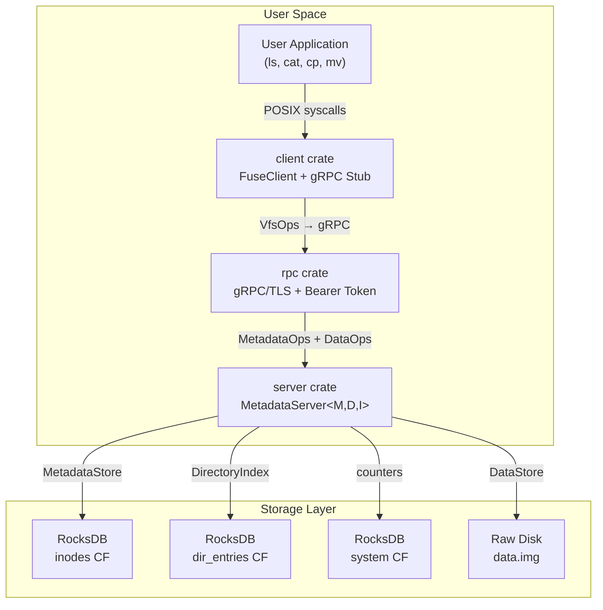

#### 关键设计决策

| 设计维度 | 当前选择 | 说明 |
|---------|---------|------|
| **元数据存储** | RocksDB (单实例, 3个 Column Family) | `inodes` CF 存 inode 属性，`dir_entries` CF 存目录结构，`system` CF 存系统计数器 |
| **数据存储** | RawDiskDataStore (本地裸文件) | 文件内容以 inode ID 为唯一索引存储在 `data.img` 中 |
| **元数据/数据关联** | 仅通过 inode ID 关联 | MetadataStore 和 DataStore 无直接依赖 |
| **KV Key 编码** | 大端序 u64 (inode) + UTF-8 (name) | 保证 RocksDB 字典序 = 数值序，支持前缀扫描 |
| **KV Value 序列化** | bincode (定长二进制) | `InodeValue` = FileAttr 各字段的定长拼接 |
| **事务保证** | RocksDB WriteBatch | 跨 CF 原子写入，保证 create/rename 等操作的一致性 |
| **通信方式** | gRPC (protobuf + TLS) | Client/Server 可分离部署，也可单进程 demo 模式 bypass gRPC |
| **部署模式** | 单机 (demo) / 分离部署 (production) | 当前以 demo 单进程模式为主要开发目标 |

#### RocksDB Column Family Schema

```
┌────────────────────────────────────────────────────────────────┐
│                    Single RocksDB Instance                     │
├──────────────┬──────────────────┬──────────────────────────────┤
│  inodes CF   │  dir_entries CF  │        system CF             │
├──────────────┼──────────────────┼──────────────────────────────┤
│ Key:         │ Key:             │ Key:                         │
│  inode (8B)  │  parent (8B)     │  ASCII string                │
│              │  + name (var)    │  (e.g. "next_inode")         │
├──────────────┼──────────────────┼──────────────────────────────┤
│ Value:       │ Value:           │ Value:                       │
│  InodeValue  │  child_inode(8B) │  depends on key              │
│  (bincode)   │  + kind (4B)    │  (e.g. u64 counter)          │
└──────────────┴──────────────────┴──────────────────────────────┘
```

#### 当前架构的特征定位

从技术分类来看，RucksFS 当前架构最接近 **TableFS** 的设计理念——使用 LSM-tree KV 存储（RocksDB）管理全量元数据，将元数据与文件数据存储分离，在单机环境下运行。其主要差异在于：

- RucksFS 使用 Rust 实现（TableFS 为 C++）
- RucksFS 通过 gRPC 支持 Client/Server 分离部署
- RucksFS 将目录索引独立为 `DirectoryIndex` trait，具备模块替换能力

### 1.3 调研范围与方法论

本调研覆盖以下 9 个系统，按技术演进阶段分为三组：

| 阶段 | 系统 | 时间 | 类型 |
|------|------|------|------|
| 早期学术探索 | TableFS | 2013 | 学术原型 |
| | IndexFS | 2014/2015 | 学术原型 |
| | LocoFS | 2017 | 学术原型 |
| 云原生对象存储 | S3/COS | 2006~ | 工业系统 |
| | 百度沧海 TafDB | 2020~ | 工业系统 |
| | Hadoop Ozone | 2018~ | 开源项目 |
| 研究进阶 | Mantle | 2025 | 学术论文 |
| | MetaHive | 2024 | 学术论文 |
| | FUSEE | 2023 | 学术论文 |

每个系统的分析覆盖 **7 个维度**：

1. 元数据 KV 存储实现方式（Key 编码、Value 结构、存储引擎选型）
2. 解决的核心问题
3. 架构类型（分布式 / 非分布式）
4. 主要应用领域
5. 缺点与不足
6. 元数据与数据存储的协作方式
7. 性能影响分析（正面收益 + 负面开销）

---

## 2. 系统深度分析

### 2.1 早期学术探索

#### 2.1.1 TableFS (2013)

**论文：** *TABLEFS: Enhancing Metadata Efficiency in the Local File System* — Kai Ren, Garth Gibson (Carnegie Mellon University), USENIX ATC 2013

##### 架构概览

TableFS 是第一个系统性地将 NoSQL KV 存储（LevelDB）嵌入本地文件系统用于元数据管理的学术原型。它作为**堆叠式文件系统（Stacked FS）** 构建在 EXT4 之上，通过 FUSE 暴露标准 POSIX 接口。

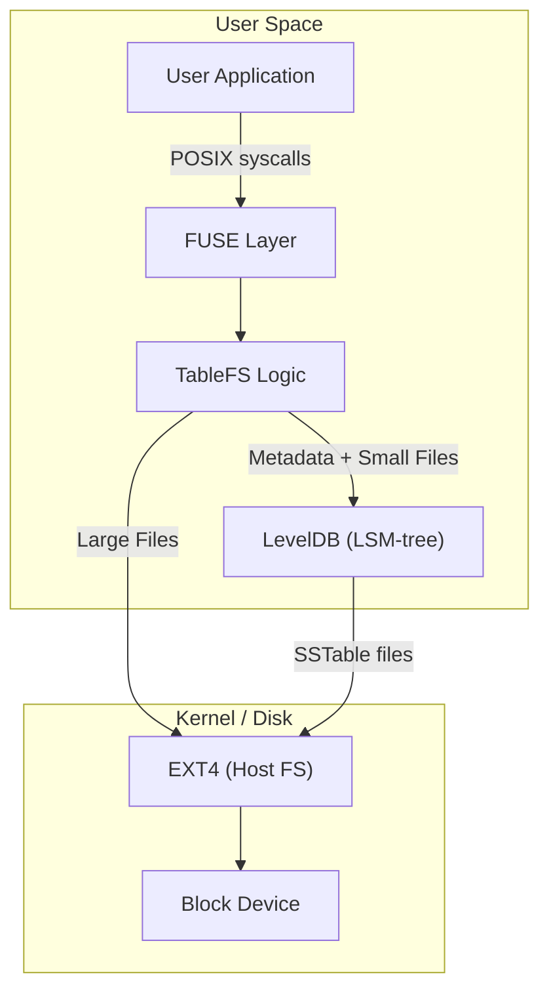

**核心思想：** 将文件系统的全部元数据（inode 属性 + 目录项）以及小文件内容都存入 LevelDB，只有大文件才落地到宿主文件系统（EXT4）的对象存储路径中。

##### (a) 元数据 KV 存储实现方式

| 维度 | 设计 |
|------|------|
| **Key 编码** | `ParentHandle (64-bit global ID) + FileName (variable)` |
| **Value 结构** | 目录：`struct stat`（元数据属性）<br/>小文件：`struct stat + file content`（内联存储）<br/>硬链接：独立条目，`null` key 引用 |
| **存储引擎** | LevelDB（LSM-tree，Google 开源） |
| **全局 ID** | 每个文件/目录分配唯一的 64-bit ID，根目录固定为 0 |
| **大文件处理** | 存入 EXT4 下的 `/LargeFileStore/J/I` 路径，其中 `I` 是文件 ID，`J = I/10000`（避免单目录过大） |
| **原子性** | 利用 LevelDB WriteBatch 保证跨操作原子更新 |

##### (b) 解决的核心问题

传统文件系统（EXT4、XFS、Btrfs）针对大文件顺序 I/O 进行了深度优化，但在**元数据密集型工作负载**（如创建/删除大量小文件、频繁 stat/chmod 操作）下表现不佳。根本原因是：

1. B-tree 的**就地更新（in-place update）** 产生大量随机磁盘寻址
2. 小的、碎片化的元数据写入无法充分利用磁盘带宽
3. 每次元数据修改都需要同步写入日志，增加延迟

TableFS 通过 LSM-tree 的**日志结构化写入**将随机 I/O 转换为顺序 I/O，同时利用内存中的 MemTable 批量聚合小写入，大幅提升元数据吞吐。

##### (c) 架构类型

**单机、非分布式。** TableFS 完全运行在单台机器上，作为本地文件系统的替代方案。

##### (d) 主要应用领域

- 高性能计算（HPC）中的检查点写入场景（大量小文件创建）
- Web 服务器的元数据密集型工作负载
- 邮件服务器（Maildir 格式，百万级小文件）
- 任何需要在本地文件系统上高效管理大量小文件的场景

##### (e) 缺点与不足

| 缺点 | 详细说明 |
|------|---------|
| **FUSE 用户态开销** | 每次系统调用需要 2 次内核/用户态上下文切换，引入约 ~3-5μs 额外延迟 |
| **LSM-tree 读放大** | 点查询可能需要检查多个 SSTable 层级，尤其在 compaction 不及时时 |
| **Compaction 干扰** | 后台 compaction 会占用 CPU 和磁盘带宽，影响前台操作的尾延迟 |
| **不支持分布式** | 单机设计无法扩展到多节点场景 |
| **依赖宿主文件系统** | 大文件仍然依赖 EXT4，无法完全脱离传统文件系统 |
| **目录遍历性能** | readdir 依赖 LevelDB 的范围查询，深层嵌套目录可能较慢 |

##### (f) 元数据与数据存储的协作方式

- **小文件（内联存储）：** 元数据和文件内容**合并为一个 KV 对**存入 LevelDB，一次写入即可完成。这消除了元数据与数据之间的 I/O 分离开销，对小文件非常高效。
- **大文件（分离存储）：** 元数据存入 LevelDB（`struct stat`），文件内容存入 EXT4 的对象存储路径。两者通过全局 64-bit ID 关联。大文件的 `read`/`write` 操作直接走 EXT4，不经过 LevelDB。

##### (g) 性能影响分析

**正面收益：**
- 在元数据密集型工作负载下，相比 EXT4 性能提升 **50% ~ 1000%（1~10 倍）**
- 即使是 FUSE 实现（用户态开销明显），在数据密集型场景下也能匹配 EXT4 的性能
- LSM-tree 的顺序写入模式有效利用磁盘带宽，减少了大量随机寻址

**负面开销：**
- FUSE 上下文切换增加了 ~3-5μs 的固定延迟
- LevelDB 的 compaction 操作会产生**写放大**（典型为 10~30 倍），消耗额外的磁盘带宽
- 对于大文件操作，性能与原生 EXT4 持平，没有额外收益

#### 2.1.2 IndexFS (2014/2015)

**论文：** *IndexFS: Scaling File System Metadata Performance with Stateless Caching and Bulk Insertion* — Kai Ren, Qing Zheng, Swapnil Patil, Garth Gibson (Carnegie Mellon University), SC'14 **最佳论文奖**

##### 架构概览

IndexFS 是 TableFS 的分布式进化版本，作为**中间件层（Middleware）** 部署在现有分布式文件系统（PVFS、Lustre、HDFS）之上，专门加速元数据操作。它将命名空间分区到多个元数据服务器上，并引入客户端无状态缓存和批量插入两大创新。

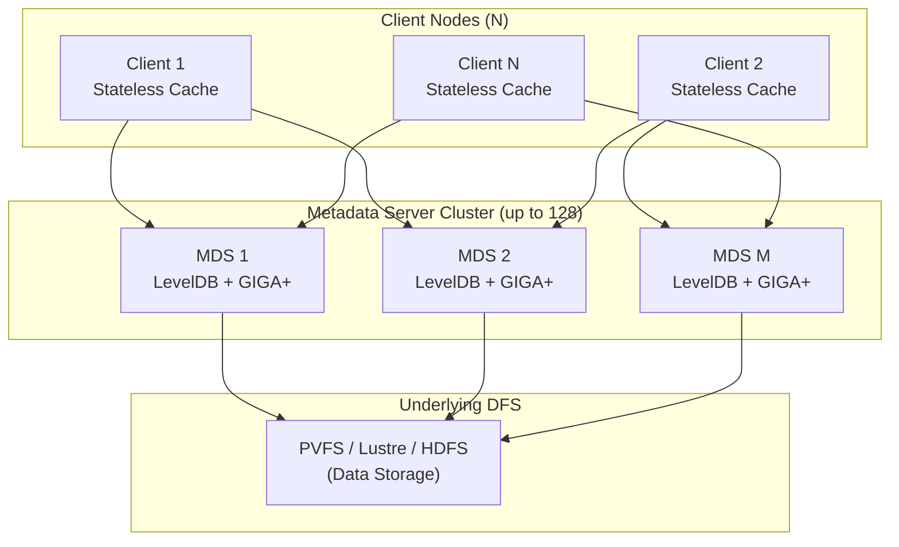

**核心思想：** 不修改底层分布式文件系统，而是在其上叠加一层可水平扩展的元数据服务，通过 GIGA+ 目录分裂算法实现命名空间的动态分区。

##### (a) 元数据 KV 存储实现方式

| 维度 | 设计 |
|------|------|
| **Key 编码** | 与 TableFS 一致：`ParentHandle (64-bit) + FileName (variable)` |
| **Value 结构** | `struct stat`（文件/目录属性）+ 可选的小文件内容 |
| **存储引擎** | 每个 MDS 节点使用独立的 LevelDB 实例 |
| **命名空间分区** | **GIGA+** 算法：基于哈希的目录分裂 |
| **缓存机制** | 客户端**无状态租约缓存（Lease-based Stateless Cache）** |
| **批量操作** | 将大量 create 操作聚合为 **Bulk Insertion**，利用 SSTable 直接注入 |

**GIGA+ 目录分裂机制：**
- 小目录（<128 项）保持在单个 MDS 上，保留局部性
- 大目录根据文件名哈希值动态分裂到多个 MDS
- 分裂粒度递进：从 1 个 MDS 扩展到 2、4、8... 直至所有 MDS
- 客户端通过位图（bitmap）缓存分裂状态，可容忍过期信息（遇到错误时刷新）

##### (b) 解决的核心问题

传统分布式文件系统（HDFS、Lustre、PVFS）采用**单个元数据服务器**，在以下场景遭遇严重瓶颈：

1. **N-N 检查点写入：** HPC 应用中数千个计算节点同时创建检查点文件，单个 MDS 成为热点
2. **大规模目录操作：** 单个目录包含百万级文件时，listing 和 lookup 操作极慢
3. **元数据创建吞吐：** 单节点 MDS 的创建操作受限于磁盘 IOPS（~1000 ops/s）

IndexFS 通过将元数据分布到最多 **128 个 MDS** 上，实现了接近线性的元数据吞吐扩展。

##### (c) 架构类型

**分布式。** IndexFS 由多个元数据服务器（MDS）集群 + 多个客户端组成，部署在现有 DFS 之上。

##### (d) 主要应用领域

- 高性能计算（HPC）集群的大规模检查点（N-N checkpointing）
- 科学计算工作流（大量小文件的创建和管理）
- 任何使用 PVFS/Lustre/HDFS 但受限于元数据瓶颈的场景
- 典型规模：数千计算节点、数十亿文件

##### (e) 缺点与不足

| 缺点 | 详细说明 |
|------|---------|
| **中间件复杂性** | 需要在现有 DFS 之上部署额外的 MDS 集群，增加运维负担 |
| **GIGA+ 分裂开销** | 大目录分裂时需要跨节点迁移元数据，产生短暂性能抖动 |
| **rename 操作昂贵** | 跨分区 rename 需要分布式事务，涉及多个 MDS 协调 |
| **LevelDB compaction** | 每个 MDS 上的 LevelDB 仍然面临 compaction 写放大问题 |
| **一致性开销** | 租约过期后需要重新验证缓存，增加尾延迟 |
| **不处理数据通路** | 仅加速元数据操作，文件数据的读写仍由底层 DFS 负责 |

##### (f) 元数据与数据存储的协作方式

IndexFS 采用**完全分离**的设计：
- **元数据：** 全部存在 IndexFS 的 MDS 集群中（LevelDB），包括 inode 属性和目录结构
- **文件数据：** 全部由底层 DFS（PVFS/Lustre/HDFS）负责存储和读写
- **关联方式：** 通过文件路径 → inode → 底层 DFS 的文件位置链接

客户端发起数据操作时：先通过 IndexFS MDS 查找元数据（获取文件位置），然后直接与底层 DFS 交互进行数据读写。

##### (g) 性能影响分析

**正面收益：**
- 在 128 个 MDS 节点上，元数据吞吐相比单节点 PVFS 提升 **50 倍 ~ 100 倍**
- 单个 MDS 节点的元数据吞吐达到底层 KV 存储（LevelDB）极限的 **93%**（对比 PVFS 仅达到 18%）
- 客户端缓存在重复访问同一目录时可减少 **80%+** 的服务端请求
- Bulk Insertion 在检查点写入场景下可提速 **3~5 倍**

**负面开销：**
- 中间件引入额外的网络跳数（客户端 → MDS → DFS）
- 每个 MDS 节点都运行 LevelDB，compaction 在集群级别产生聚合写放大
- GIGA+ 分裂时短暂不可用（~100ms 级别）
- 总体系统复杂度高，debug 和故障排查困难

#### 2.1.3 LocoFS (2017)

**论文：** *LocoFS: A Loosely-Coupled Metadata Service for Distributed File Systems* — Siyang Li, Youyou Lu, Jiwu Shu 等 (清华大学), SC'17

##### 架构概览

LocoFS 是对 IndexFS 的进一步优化，核心创新在于**松散耦合（Loosely-Coupled）** 的元数据架构设计。它将目录元数据和文件元数据分离到不同类型的服务器上，通过扁平化命名空间来最大化 KV 存储的原生性能。

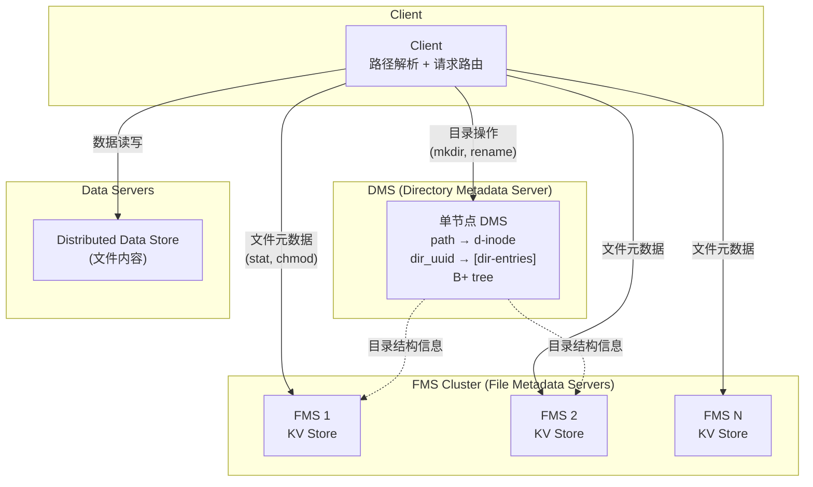

**核心思想：** 传统分布式文件系统将目录树和文件元数据耦合在一起管理，导致简单的文件操作（如 `create`）也需要多次跨节点通信来更新目录树。LocoFS 通过将**目录结构**（DMS）和**文件属性**（FMS）解耦，减少操作间的依赖关系，让 KV 存储的高吞吐能力得以释放。

##### (a) 元数据 KV 存储实现方式

| 维度 | 设计 |
|------|------|
| **DMS Key** | `path → d-inode`（目录 inode）和 `dir_uuid → [child entries concatenation]`（目录项串联） |
| **FMS Key** | `dir_uuid + file_name → f-inode`（文件 inode），通过一致性哈希分布到 FMS 节点 |
| **Value 结构 — d-inode** | 目录属性（权限、时间戳等），子目录项作为串联列表存储 |
| **Value 结构 — f-inode** | 进一步拆分为 **access 部分**（权限、uid/gid）和 **content 部分**（size、block mappings），按需访问 |
| **存储引擎** | DMS 使用 B+ tree；FMS 使用 KV Store（论文中为自定义实现） |
| **零序列化设计** | 文件元数据存为**定长结构体**，直接作为 KV 的 Value 存储，避免序列化/反序列化开销 |

**三级解耦策略：**
1. **目录结构 vs 文件属性解耦：** 目录操作（mkdir, rename）走 DMS，文件操作（stat, chmod）走 FMS
2. **目录内容 vs 目录属性解耦：** 目录项串联存储，目录属性（如 mtime）延迟更新
3. **文件 access 属性 vs content 属性解耦：** 权限检查只读 access 部分，避免读取不必要的 block mapping 信息

##### (b) 解决的核心问题

IndexFS 虽然实现了元数据的分布式扩展，但其**紧耦合的目录树结构**导致了以下问题：

1. **文件创建的链式依赖：** 创建一个文件需要：查找父目录 → 更新父目录 → 创建文件元数据 → 更新目录计数，涉及多个 KV 操作和跨节点通信
2. **KV 存储利用率低：** IndexFS 单节点仅能达到底层 KV 存储峰值吞吐的 **18%**
3. **网络延迟累积：** 层级路径解析需要逐级查找，每级都可能需要一次网络往返

LocoFS 通过扁平化和松散耦合，将单节点 KV 利用率提升到 **93%**。

##### (c) 架构类型

**分布式，但 DMS 为单节点。** FMS 可水平扩展（多节点），但 DMS 是集中式的单节点设计，负责所有目录树操作。

##### (d) 主要应用领域

- 与 IndexFS 类似的 HPC 场景
- 需要极高元数据 IOPS 的工作负载（如 AI 训练的数据预处理）
- 大规模文件创建/删除场景
- 分布式文件系统的元数据加速层

##### (e) 缺点与不足

| 缺点 | 详细说明 |
|------|---------|
| **单点 DMS 瓶颈** | DMS 集中处理所有目录操作（mkdir, rmdir, rename），在 rename 密集型工作负载下成为瓶颈 |
| **POSIX 语义放松** | 父目录属性（mtime 等）采用延迟更新，不严格符合 POSIX 语义 |
| **rename 仍然昂贵** | 跨目录 rename 需要 DMS 和 FMS 协同修改，引入分布式协调开销 |
| **DMS 容错复杂** | 单点 DMS 的故障恢复需要完整的状态重建 |
| **truncate 性能问题** | 文件截断需要同步操作防止过期块读取，增加延迟 |

##### (f) 元数据与数据存储的协作方式

- **元数据（DMS + FMS）：** 目录结构由 DMS 管理，文件属性由 FMS 管理
- **数据存储：** 独立的数据服务器集群，通过 f-inode 中的 content 部分（block mappings）定位
- **操作流程举例（文件创建）：**
  1. 客户端向 DMS 查询父目录的 `dir_uuid`
  2. 客户端对 `dir_uuid + file_name` 进行哈希，确定目标 FMS 节点
  3. 客户端向目标 FMS 创建 `f-inode`
  4. DMS 异步更新目录项列表

这种设计使得文件创建操作的关键路径只涉及 **1 次 FMS 写入**（加 1 次 DMS 查询），大幅减少了网络往返。

##### (g) 性能影响分析

**正面收益：**
- 单节点 FMS 的元数据吞吐达到底层 KV 存储的 **93%**（IndexFS 仅 18%，提升 ~5 倍）
- 8 节点集群下，元数据吞吐相比 IndexFS 提升 **5 倍**
- 文件创建操作的网络往返次数减少到最少 **1-2 次**（IndexFS 需要 3-5 次）
- 零序列化设计消除了 CPU 开销（在高吞吐场景下尤为重要）

**负面开销：**
- DMS 单点在目录操作密集时成为瓶颈（如大规模 mkdir/rename）
- 延迟更新父目录属性可能导致应用看到不一致的 mtime
- 系统整体架构更复杂（DMS + FMS + 数据服务器），部署和运维成本增加

### 2.2 面向对象存储 & 云原生层级命名空间

#### 2.2.1 S3/COS 对象存储

**代表系统：** AWS S3 (2006~)、腾讯 COS、阿里 OSS 等

##### 架构概览

对象存储是云计算时代最成功的存储范式之一。与传统文件系统的层级目录树不同，对象存储采用**扁平命名空间（Flat Namespace）** ——对象名作为 Key、对象内容 + 元属性作为 Value，天然适合 KV 存储模型。

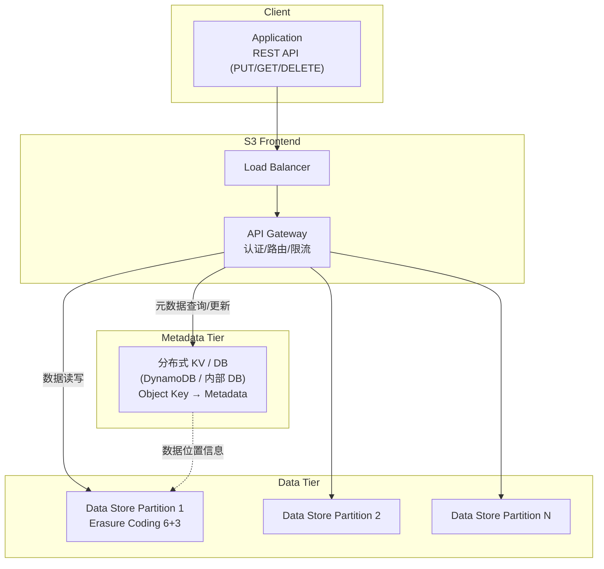

**核心思想：** 放弃层级目录语义，以对象为粒度进行扁平化管理。对象名（如 `photos/2024/beach.jpg`）看起来像路径，但实际上只是一个普通的字符串 Key，不存在目录层级关系。

##### (a) 元数据 KV 存储实现方式

| 维度 | 设计 |
|------|------|
| **Key 编码** | `BucketName + "/" + ObjectKey`（字符串，全局唯一） |
| **Value 结构** | 系统元数据（21 个字段：创建时间、存储类型、大小、ETag 等）+ 用户自定义标签 + 数据块位置信息 |
| **存储引擎** | AWS 内部使用 DynamoDB（分布式 KV）；腾讯 COS 使用自研分布式表格存储 |
| **命名空间** | 完全扁平，通过 Prefix 前缀模拟目录结构 |
| **一致性模型** | AWS S3 自 2020 年起支持**强一致性读后写（Strong Read-After-Write Consistency）** |
| **分区策略** | 基于 Key 的一致性哈希，自动分区和再平衡，支持万亿级对象 |

##### (b) 解决的核心问题

对象存储解决了传统文件系统在云环境中的三个根本限制：

1. **无限扩展性：** 扁平 KV 模型不存在目录树的层级瓶颈，可以水平扩展到数百万亿对象（AWS S3 在 2024 年存储超过 400 万亿对象）
2. **简单 API：** REST 接口（PUT/GET/DELETE）相比 POSIX 接口大幅简化，适合互联网规模应用
3. **多租户隔离：** Bucket 作为命名空间边界，天然支持多租户资源隔离

##### (c) 架构类型

**分布式，且是超大规模分布式。** S3 跨至少 3 个可用区（AZ）部署，使用纠删码（Erasure Coding）实现 11 个 9 的持久性。

##### (d) 主要应用领域

- 互联网应用的静态资源存储（图片、视频、文档）
- 大数据分析的数据湖底座
- AI/ML 训练数据集存储
- 备份与归档
- CDN 源站

##### (e) 缺点与不足

| 缺点 | 详细说明 |
|------|---------|
| **不支持 POSIX 语义** | 没有目录、硬链接、原子 rename 等语义，无法直接挂载为文件系统 |
| **List 操作昂贵** | 模拟目录的 Prefix List 需要扫描大量 Key，在百万级子项目录下极慢 |
| **无原子目录操作** | 没有 mkdir/rmdir/rename，模拟这些操作需要多次 API 调用，不保证原子性 |
| **延迟较高** | REST API 的网络开销 + 分布式元数据查询导致单次操作延迟在数毫秒级 |
| **小文件性能差** | 每个小文件都是独立对象，元数据开销占比高 |
| **最终一致性残留** | 虽然 S3 已支持强一致性，但某些跨区域复制场景仍为最终一致 |

##### (f) 元数据与数据存储的协作方式

对象存储的元数据和数据**完全分离存储**：
- **元数据层：** 对象的 Key、属性、ACL、标签、数据块位置列表存在分布式 KV/DB 中
- **数据层：** 对象的实际内容以 Erasure Coding 分块存储在数据节点上（跨多个 AZ）
- **关联方式：** 元数据中的位置信息（block location list）指向数据层的具体分块位置

**操作流程（PUT Object）：**
1. 客户端发送对象到 API Gateway
2. API Gateway 将数据分块，Erasure Coding 编码后写入数据节点
3. 数据写入成功后，更新元数据 KV（对象 Key → 元属性 + 块位置列表）
4. 返回成功

##### (g) 性能影响分析

**正面收益：**
- 扁平 KV 模型使得对象的 CRUD 操作复杂度为 O(1)，不受目录深度影响
- 分布式元数据层可水平扩展，支撑千万级 QPS
- 数据与元数据分离使得两者可以独立扩展和优化

**负面开销：**
- 单对象操作延迟较高（~1-10ms），不适合低延迟元数据密集型工作负载
- Prefix List（模拟 readdir）操作在大目录下性能退化严重
- 小文件场景下元数据开销占比高，存储效率低
- 缺乏 POSIX 语义限制了作为通用文件系统的适用性

#### 2.2.2 百度沧海 TafDB

**出处：** 百度智能云技术博客 / 百度沧海·存储团队公开分享 (2020~)

##### 架构概览

TafDB 是百度自主研发的**分布式事务 KV 数据库**，作为百度沧海·存储的统一元数据底座，同时支撑对象存储 BOS（平坦命名空间）、文件存储 CFS（层级命名空间）和归档存储 AFS 的元数据管理需求。它采用类 Spanner 架构，支持万亿级元数据存储和千万级 QPS。

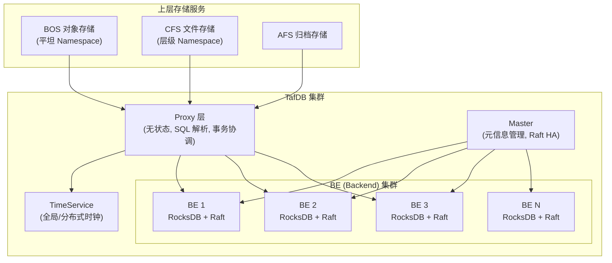

**核心思想：** 用一套分布式事务数据库统一支撑多种存储服务的元数据需求，避免每种服务各自维护独立的元数据系统。通过自定义分裂策略和事务优化，将大部分跨分片事务（2PC）优化为单分片事务（1PC），在保证强 ACID 的同时实现高性能。

##### (a) 元数据 KV 存储实现方式

| 维度 | 设计 |
|------|------|
| **存储引擎** | 每个 BE 节点使用 RocksDB（LSM-tree），数据按 Tablet 组织 |
| **复制协议** | Multi-Raft：不同 BE 的多个 Tablet 形成 Raft Group，3 副本高可用 |
| **事务模型** | 类 Spanner 的分布式事务：2PC + MVCC（多版本并发控制） |
| **时钟方案** | 初期为单点 TSO（百万 QPS），后演进为分布式时钟（每节点本地时钟 + 跨分片广播） |
| **分区策略** | 按 Key Range 自动分裂/合并 Tablet |
| **特化优化 — 层级 NS** | 自定义分裂策略，保证同层目录元数据不跨分片，将跨分片事务变为单分片事务 |
| **特化优化 — 平坦 NS** | 二级索引异步写入，主数据写入即刻返回 |

**层级命名空间的 KV Schema（CFS）：**
- 每个 inode 节点对应数据库中的一行记录
- 目录操作（create、rename）转化为数据库事务
- 父目录属性和子项数据置于同分片，避免跨分片事务

**平坦命名空间的 KV Schema（BOS）：**
- 对象 Key → 对象元数据（系统属性 + 用户标签 + 块位置）
- 二级索引（如按时间排序）异步维护

##### (b) 解决的核心问题

1. **统一元数据底座：** 之前百度的 BOS、CFS、AFS 各自维护独立的元数据系统，运维成本高、无法复用优化成果。TafDB 统一了底层存储
2. **无限扩展性：** 传统方案（如数据库中间件）只能倍数扩容，TafDB 支持线性扩展到万亿级元数据
3. **强 ACID 保证：** 文件系统的 rename 等操作需要跨多行原子更新，传统 KV 存储无法提供事务保证
4. **消除单点瓶颈：** HDFS NameNode 等单机方案的容量和吞吐受限于单机，TafDB 无此限制

##### (c) 架构类型

**分布式，类 Spanner 架构。** 包含 Proxy（无状态）、BE（数据节点，Multi-Raft）、Master（元信息管理）、TimeService（全局时钟）四个核心组件。

##### (d) 主要应用领域

- 百度智能云对象存储 BOS（支撑万亿对象）
- 百度文件存储 CFS（支撑千亿文件，EuroSys'23 论文）
- 百度归档存储 AFS
- 大规模数据湖存储底座
- AI 训练数据管理

##### (e) 缺点与不足

| 缺点 | 详细说明 |
|------|---------|
| **实现复杂度极高** | 类 Spanner 架构涉及分布式事务、Multi-Raft、MVCC、全局时钟等，工程量巨大 |
| **LSM-tree 删除性能问题** | RocksDB 的 Tombstone 标记 + TafDB 的 MVCC 版本删除，双重垃圾导致范围查询性能退化 |
| **写延迟较高** | 跨分片事务需要 2PC（多次 RPC），即使优化后仍高于单机方案 |
| **资源消耗大** | 3 副本 Raft 复制消耗 3 倍存储和网络带宽 |
| **非开源** | 百度内部系统，无法直接被外部项目使用 |
| **时钟服务复杂** | 分布式时钟方案虽消除了单点，但引入了时钟偏移容忍和因果序保证的复杂性 |

##### (f) 元数据与数据存储的协作方式

TafDB **仅负责元数据存储**，文件/对象的实际数据由独立的数据存储系统管理：

- **BOS 数据：** 对象内容存储在百度自研的分布式块存储系统中，TafDB 中记录块位置列表
- **CFS 数据：** 文件内容存储在分布式块存储中，TafDB 中的 inode 记录包含块映射信息
- **关联方式：** 通过 inode / Object Key → 块位置列表 进行关联

**层级 NS 操作流程（CFS rename）：**
1. Proxy 接收 rename 请求
2. 在 TafDB 中启动分布式事务
3. 修改源目录项、目标目录项、文件 inode（如果同分片则为 1PC，否则 2PC）
4. 提交事务，返回成功

##### (g) 性能影响分析

**正面收益：**
- 统一底座减少了 3 套独立元数据系统的运维成本
- 读写性能领先开源方案（如 TiDB/CockroachDB）**2 倍以上**
- 自定义分裂策略使得 CFS 的目录操作绝大多数为 1PC，延迟接近单机方案
- 支撑单 Bucket 从百亿级扩展到万亿级

**负面开销：**
- 3 副本 Raft 复制带来 3 倍存储成本和网络带宽消耗
- 小范围 2PC 事务仍然存在，尾延迟（P99）相比单机方案高出 2~5 倍
- 多层次 GC（应对 LSM-tree + MVCC 的双重删除标记）增加了后台 CPU 和 I/O 开销
- 系统整体复杂度高，debug 和故障定位困难

#### 2.2.3 Hadoop Ozone

**项目：** Apache Ozone (2018~)，Hadoop 生态的下一代分布式对象存储

##### 架构概览

Apache Ozone 是为解决 HDFS 的元数据扩展性瓶颈而设计的分布式对象/文件存储系统。它的核心创新在于将**命名空间元数据**（由 Ozone Manager 管理）和**块级元数据**（由 Storage Container Manager 管理）彻底分离，两者都使用 RocksDB 作为持久化引擎。

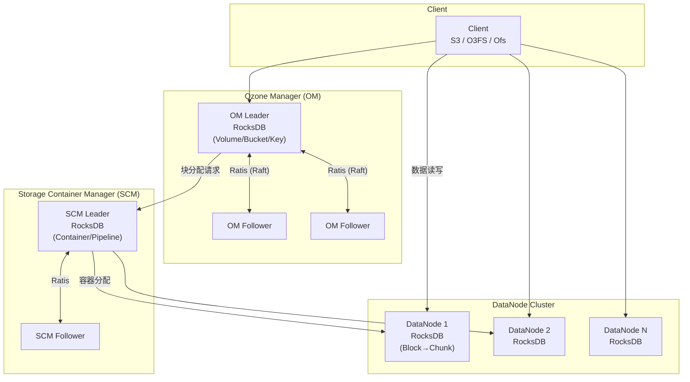

**核心思想：** HDFS 的 NameNode 将全部元数据存在内存中（~150 bytes/file），单机内存限制了文件总量（~10 亿）。Ozone 通过将元数据持久化到 RocksDB（磁盘），突破了内存瓶颈，支持数百亿对象。同时引入 Container 抽象，将块级复制从单块粒度提升到容器粒度（默认 5GB），大幅减少了心跳元数据量。

##### (a) 元数据 KV 存储实现方式

| 维度 | 设计 |
|------|------|
| **OM 的 Key** | `Volume/Bucket/Key` 三级层级映射；Key → Block 映射 |
| **OM 的 Value** | 对象属性（大小、ACL、创建时间等）+ Block 位置列表 |
| **SCM 的 Key** | Container ID → Pipeline 配置 + 副本位置 |
| **DataNode 的 Key** | Block ID → Chunk 列表（本地 RocksDB） |
| **存储引擎** | **三处均使用 RocksDB**：OM、SCM、每个 DataNode 各一个实例 |
| **复制协议** | Apache Ratis（Raft 实现），OM 和 SCM 各自独立的 3 节点 Raft 集群 |
| **Container 抽象** | 默认 5GB 的容器，包含多个 Block，以容器为粒度进行复制和管理 |

**三级 RocksDB 架构：**
1. **OM RocksDB：** 全局命名空间元数据（体量最大，可达数百 GB）
2. **SCM RocksDB：** 容器/Pipeline 元数据（体量较小）
3. **DataNode RocksDB：** 每个节点的本地块→Chunk 映射（分散存储）

##### (b) 解决的核心问题

1. **HDFS 的 10 亿文件天花板：** HDFS NameNode 将全部元数据存在内存中（每文件 ~150 字节），64GB 内存约支撑 4 亿文件。Ozone 使用 RocksDB 持久化，理论上无容量上限
2. **心跳风暴：** HDFS 中 DataNode 按块报告状态，百万级块 × 千节点 = 数十亿心跳条目。Ozone 按容器报告（5GB/容器），心跳量降低 **3~4 个数量级**
3. **多协议支持：** HDFS 仅支持 HDFS 协议，Ozone 同时支持 S3、O3FS（HDFS 兼容）和 Ofs 三种协议

##### (c) 架构类型

**分布式。** OM 和 SCM 各为 3 节点 Raft 集群（HA），DataNode 可水平扩展到数千节点。

##### (d) 主要应用领域

- 大数据分析（Hadoop/Spark/Hive 生态集成）
- 数据湖存储
- 混合云对象存储
- HDFS 的下一代替代方案
- Kubernetes 持久化存储（CSI 驱动）

##### (e) 缺点与不足

| 缺点 | 详细说明 |
|------|---------|
| **OM 仍为准单点** | 虽有 Raft HA，但所有命名空间操作仍由单个 Leader OM 处理，吞吐受限 |
| **元数据扩展性有限** | OM 的 RocksDB 存储全部命名空间元数据，在百亿级对象下可能面临性能退化 |
| **小文件问题未完全解决** | 每个小文件仍占用一个独立的容器空间（存在内部碎片），Container 的最小粒度限制了效率 |
| **项目成熟度** | 相比 HDFS 的 15+ 年积累，Ozone 的生态和稳定性仍在成长期 |
| **RocksDB compaction** | OM 的大规模 RocksDB 面临 compaction 写放大和空间放大 |
| **rename 操作** | 跨 Bucket 的 rename 需要复杂的分布式协调 |

##### (f) 元数据与数据存储的协作方式

Ozone 的元数据和数据存储**三级分离**：

- **OM（命名空间元数据）：** 管理 Volume → Bucket → Key 的层级结构和 Key → Block 映射
- **SCM（块级元数据）：** 管理 Container → Pipeline → DataNode 的映射关系
- **DataNode（数据存储）：** 实际存储文件内容（以 Chunk 为单位），本地 RocksDB 管理 Block → Chunk 映射

**写入流程：**
1. 客户端向 OM 发起 CreateKey 请求
2. OM 向 SCM 申请块空间，SCM 返回 Container + Pipeline 信息
3. 客户端直接向 DataNode 写入数据（走 Ratis Pipeline 复制）
4. 写入完成后，OM 更新 Key → Block 映射（RocksDB WriteBatch）

##### (g) 性能影响分析

**正面收益：**
- RocksDB 持久化使得对象容量从 HDFS 的 ~10 亿提升到 **数百亿级**
- Container 粒度复制减少心跳量 3~4 个数量级，DataNode 扩展到数千节点
- 多协议（S3 + HDFS 兼容）支持更广泛的工作负载
- RocksDB 的 LSM-tree 对写入密集型元数据操作友好

**负面开销：**
- OM 的 RocksDB 相比 HDFS 的全内存方案，单次 lookup 延迟从 ~100ns 增加到 ~10μs（100 倍）
- 元数据操作的吞吐不如全内存方案（HDFS NameNode 单机可达 ~10 万 ops/s，OM 受 RocksDB 限制可能更低）
- Raft 复制为 OM 的写入路径增加了 1~2 次额外网络往返
- 大规模 compaction 可能导致 OM 的尾延迟抖动

### 2.3 研究进阶 / 性能优化

#### 2.3.1 Mantle (SOSP'25)

**论文：** *Mantle: A Scalable Hierarchical Namespace for Object Storage* — 百度沧海·存储团队, SOSP 2025

##### 架构概览

Mantle 是百度沧海·存储团队提出的分布式层级命名空间系统，解决了对象存储在支持层级目录语义时面临的性能和扩展性难题。其核心创新在于**两层元数据架构**：底层的 TafDB 负责全量持久化和事务处理，上层的 IndexNode 负责高频路径解析和权限检查的加速缓存。

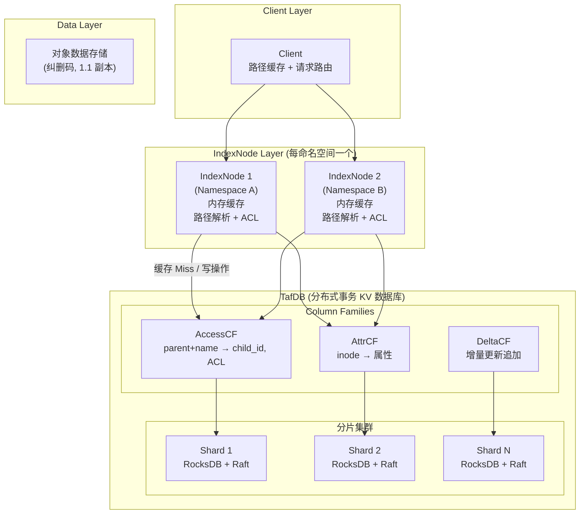

**核心思想：** 把全量元数据的长期存储和事务处理交给可扩展的 TafDB（分布式事务 KV），把高频的路径解析和权限检查交给每个命名空间独立的 IndexNode（内存缓存层），实现"强一致性 + 低延迟"的双重目标。

##### (a) 元数据 KV 存储实现方式

| 维度 | 设计 |
|------|------|
| **底层存储** | TafDB（百度自研类 Spanner 分布式事务数据库，见 §2.2.2） |
| **AccessCF** | Key: `parent_id + name` → Value: `child_id, type, ACL`（目录项 + 权限） |
| **AttrCF** | Key: `inode_id` → Value: `size, mode, uid, gid, atime, mtime, ctime, nlink`（属性） |
| **DeltaCF** | Key: `inode_id + timestamp` → Value: `delta_type + delta_value`（增量更新，追加写入） |
| **IndexNode** | 每个命名空间一个内存缓存实例，缓存路径→inode 映射和 ACL 信息 |
| **自适应架构** | 小规模（<10 亿文件）：单机事务，百微秒级延迟；大规模：自动切换分布式事务 |

**Delta Record 机制：**
- 目录属性（如子项数量、总大小）的更新不采用 read-modify-write，而是**追加一条 Delta 记录**
- 后台异步将 Delta 合并到 AttrCF 中的基准值
- 这消除了高并发下的目录属性更新竞争（如同时创建 1000 个文件时对父目录 mtime 的争抢）

##### (b) 解决的核心问题

1. **对象存储的层级命名空间性能：** 传统对象存储（S3/BOS）的 Prefix List 模拟目录操作极慢（需全量扫描），Mantle 通过真正的目录树结构实现高效 list/rename
2. **长路径解析延迟：** 深层目录路径（如 `/A/B/C/D/E/file`）需要多次跨节点 RPC。Mantle 通过 IndexNode 缓存 + 批量预取，减少交互次数
3. **分布式事务冲突：** 高并发目录操作引发跨节点锁竞争。Mantle 通过 MVCC + 同层目录不分片策略消解冲突
4. **扩展性与局部性的矛盾：** 传统认为分布式扩展必须牺牲数据局部性。Mantle 通过动态自适应架构（小规模单机事务 ↔ 大规模分布式事务）打破这一限制

##### (c) 架构类型

**分布式，两层架构。** IndexNode 层（缓存）+ TafDB 层（持久化），两层各自可独立扩展。

##### (d) 主要应用领域

- 百度智能云 BOS 对象存储（层级命名空间模式）
- AI 训练数据管理（EB 级数据湖）
- 大数据 Spark/Hive 计算加速（替代 HDFS 兼容层）
- 自动驾驶数据存储
- 云原生混合存储

##### (e) 缺点与不足

| 缺点 | 详细说明 |
|------|---------|
| **系统复杂度极高** | 两层架构（IndexNode + TafDB）加上分布式事务、MVCC、Delta 合并，工程实现极为复杂 |
| **IndexNode 缓存一致性** | 缓存失效/刷新策略需要仔细设计，否则可能返回过期数据 |
| **Delta 合并延迟** | 异步合并意味着查询父目录的子项数量可能不精确（需要读 base + 所有未合并 delta） |
| **非开源** | 百度内部系统，外部无法直接使用 |
| **冷启动问题** | IndexNode 重启后缓存为空，需要从 TafDB 重建，期间性能退化 |
| **资源消耗** | IndexNode 需要大量内存来缓存路径映射，TafDB 需要 3 副本存储 |

##### (f) 元数据与数据存储的协作方式

- **元数据（IndexNode + TafDB）：** 管理目录树结构、inode 属性、ACL、增量更新
- **数据存储：** 对象内容以纠删码（1.1 副本）存储在百度的分布式块存储中
- **关联方式：** inode/object_id → 数据块位置列表（存在 AttrCF 或独立的 BlockCF 中）

**典型操作流程（文件创建）：**
1. 客户端向 IndexNode 发起路径解析，获取父目录 inode
2. IndexNode 检查 ACL 权限（缓存命中则跳过 TafDB）
3. TafDB 中创建新 inode（AttrCF）+ 新目录项（AccessCF）+ Delta（父目录子项数 +1）
4. IndexNode 更新缓存
5. 客户端向数据层写入文件内容

##### (g) 性能影响分析

**正面收益：**
- 相比 Tectonic、InfiniFS 等方案，元数据访问延迟降低 **6.6% ~ 99.1%**
- 单桶支持 **十万 TPS**，高并发场景下吞吐量提升最高 **115 倍**
- Spark 作业完成时间缩短 **63.3% ~ 93.3%**
- AI 训练任务效率提升 **38.5% ~ 47.7%**
- IndexNode 缓存命中时，路径解析延迟降至微秒级

**负面开销：**
- IndexNode 的内存消耗：每个命名空间的缓存可能占用数 GB 到数十 GB 内存
- TafDB 的 3 副本 Raft 复制带来 3 倍存储和带宽成本
- Delta 合并的后台开销（CPU + I/O）
- 缓存未命中时需要回退到 TafDB，延迟退化到毫秒级

#### 2.3.2 MetaHive (2024)

**论文：** *MetaHive: A Cache-Optimized Metadata Management for Heterogeneous Key-Value Stores* — arXiv:2407.19090, 2024

##### 架构概览

MetaHive 是一个面向**异构 KV 存储集群**的缓存优化元数据管理系统。它的核心创新在于将元数据与数据进行**逻辑分离但物理邻近**的存储布局，通过优化缓存局部性（Cache Locality）来减少元数据检索的开销。

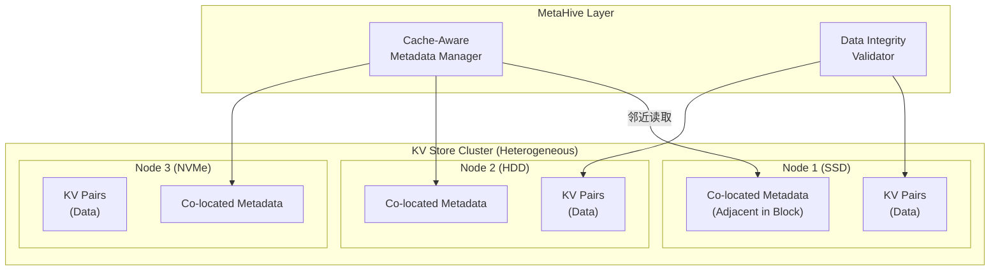

**核心思想：** 在异构 KV 存储环境中（不同节点有不同的硬件配置和软件版本），传统的元数据管理方式会导致元数据检索需要额外的 I/O 操作。MetaHive 通过将 KV 条目和其元数据在存储介质上**物理邻近放置**，使得一次缓存行加载即可同时获取数据和元数据，消除额外的读取开销。

##### (a) 元数据 KV 存储实现方式

| 维度 | 设计 |
|------|------|
| **元数据存储模型** | 逻辑分离、物理邻近：元数据与 KV 数据在同一存储块中相邻存放 |
| **元数据类型** | 数据完整性校验信息、版本号、访问控制标记等 |
| **存储引擎** | 以 RocksDB 为主要验证平台 |
| **缓存优化策略** | 利用 CPU 缓存行（Cache Line）的空间局部性，一次加载同时获取数据和元数据 |
| **异构适应** | 支持 SSD/HDD/NVMe 混合集群，自适应不同硬件的 I/O 特性 |
| **数据完整性** | 内嵌快速验证机制，在读取时零额外开销进行校验 |

##### (b) 解决的核心问题

1. **元数据检索的额外 I/O 开销：** 传统方案将元数据独立存储，每次数据读取需要额外一次元数据查询。MetaHive 通过物理邻近消除这次额外 I/O
2. **异构集群的性能一致性：** 不同节点的硬件差异导致元数据操作性能不可预测。MetaHive 自适应不同硬件特性
3. **数据完整性验证开销：** 传统方案的完整性校验需要额外的 CPU 和 I/O 开销。MetaHive 将校验信息嵌入数据布局，利用缓存局部性实现零开销验证

##### (c) 架构类型

**可分布式，也可单机。** MetaHive 本身是一个管理层/库，可嵌入到任何 KV 存储系统中（单机或分布式）。主要在 RocksDB 上进行了验证。

##### (d) 主要应用领域

- 异构 KV 存储集群的元数据管理优化
- 需要数据完整性验证的存储系统
- 混合硬件环境下的存储性能优化
- 云原生 KV 存储服务

##### (e) 缺点与不足

| 缺点 | 详细说明 |
|------|---------|
| **研究性设计** | 更偏向学术研究，工程落地的完整性和成熟度有限 |
| **修改存储布局** | 需要修改 KV 存储引擎的底层数据布局（如 SSTable 格式），侵入性强 |
| **通用性有限** | 优化高度针对 RocksDB/LSM-tree 架构，难以直接迁移到其他存储引擎 |
| **无目录/文件语义** | 不涉及文件系统层面的元数据管理（路径解析、目录结构等） |
| **性能数据有限** | 公开的基准测试结果较少，缺乏大规模生产环境验证 |
| **存储开销** | 物理邻近布局可能增加存储碎片，影响 compaction 效率 |

##### (f) 元数据与数据存储的协作方式

MetaHive 的核心创新恰恰在于元数据与数据的**协作方式**：

- **逻辑分离：** 元数据和 KV 数据在逻辑上是独立的实体，可以分别管理和更新
- **物理邻近：** 在存储介质上，元数据紧邻其对应的 KV 数据存放，共享同一个缓存行/磁盘块
- **透明性：** 元数据对下游消费者和其他 KV 存储节点保持不透明，不影响正常数据操作

这种设计类似于将 inode 属性内联到目录项中（而非存在独立的 inode 表），减少了一次间接查找。

##### (g) 性能影响分析

**正面收益：**
- 消除元数据检索的额外 I/O，理论上可减少 **~50%** 的小 KV 读取延迟
- 数据完整性验证的开销可忽略不计（利用已加载的缓存行）
- 在 RocksDB 中验证，性能退化微乎其微
- 适应异构硬件，在混合 SSD/HDD 集群中表现稳定

**负面开销：**
- 修改存储布局可能影响 LSM-tree 的 compaction 效率
- 物理邻近布局增加了存储管理的复杂性
- 在写入路径上需要额外计算元数据（如校验和），可能增加微小的写入延迟
- 不直接提升文件系统级别的元数据操作性能（如 lookup、readdir）

#### 2.3.3 FUSEE (FAST'23)

**论文：** *FUSEE: A Fully Memory-Disaggregated Key-Value Store* — Jiacheng Shen 等, USENIX FAST 2023

##### 架构概览

FUSEE 是第一个**完全解聚合（Fully Disaggregated）** 的内存 KV 存储系统。与之前的"半解聚合"方案（如 Clover）不同，FUSEE 不仅将 KV 数据存储在解聚合的内存节点上，还将**索引元数据也分布式复制**到多个内存节点，由客户端通过 RDMA 直接管理，彻底消除了集中式元数据服务器的瓶颈。

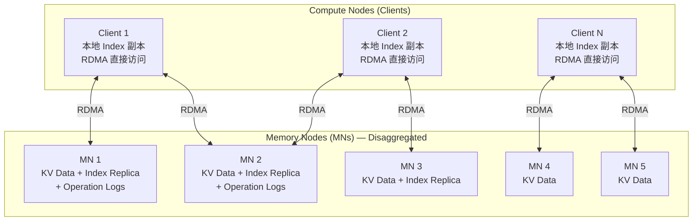

**核心思想：** 在内存解聚合（Memory Disaggregation, DM）架构中，传统的 KV 存储将索引（Hash Table / B-tree）集中在少量元数据服务器上，形成瓶颈。FUSEE 将索引元数据复制到所有内存节点上，客户端通过 RDMA 单边操作直接访问和修改索引，无需与任何中央服务器交互。

##### (a) 元数据 KV 存储实现方式

| 维度 | 设计 |
|------|------|
| **索引结构** | 分布式哈希表（Hash Table），索引副本复制到多个 MN |
| **KV 数据存储** | 分布在多个 Memory Node 的 DRAM 中 |
| **索引同步协议** | **SNAPSHOT 协议**：无需 Paxos/Raft 等共识协议，客户端通过 RDMA CAS 直接更新索引副本 |
| **内存管理** | 两级分配：客户端负责粗粒度块分配，MN 负责细粒度子块管理 |
| **故障恢复** | 在 MN 上嵌入操作日志（Operation Log），客户端崩溃后通过日志修复损坏的索引 |
| **通信方式** | RDMA 单边操作（One-sided RDMA Read/Write/CAS），绕过 CPU 直接访问远程内存 |

**SNAPSHOT 协议关键特性：**
- 客户端可以**并发地**读写不同 MN 上的索引副本，无需加锁
- 写入时使用 RDMA CAS（Compare-and-Swap）保证原子性
- 读取时获取一致性快照，容忍短暂的副本不一致
- 冲突通过版本号检测和重试解决

##### (b) 解决的核心问题

1. **元数据服务器瓶颈：** Clover 等半解聚合方案将索引集中在少量服务器上，高并发时成为吞吐瓶颈。FUSEE 通过索引复制+客户端直接访问消除这一瓶颈
2. **资源利用率低：** 传统方案中元数据服务器需要大量 CPU 和内存资源，但利用率不均衡。FUSEE 的完全解聚合使得计算和存储资源可以独立扩展
3. **客户端崩溃恢复：** 在客户端直接管理索引的模式下，客户端崩溃可能导致索引不一致。FUSEE 通过嵌入式操作日志实现低开销恢复

##### (c) 架构类型

**分布式，完全解聚合。** 没有中央元数据服务器，所有操作由客户端通过 RDMA 直接完成。

##### (d) 主要应用领域

- 数据中心内存解聚合基础设施
- 高性能计算中的内存级 KV 存储
- 分布式文件系统的内存元数据层（已有 FUSEE-FS 开源实现）
- 需要极低延迟（<10μs）元数据访问的场景
- 内存资源池化和弹性伸缩

##### (e) 缺点与不足

| 缺点 | 详细说明 |
|------|---------|
| **依赖 RDMA 硬件** | 需要高端 RDMA 网卡（如 Mellanox ConnectX 系列），硬件成本高 |
| **不持久化** | 纯内存存储，掉电即丢失数据，需要额外的持久化层 |
| **索引复制开销** | 索引副本复制到多个 MN，增加了内存消耗和写入放大 |
| **客户端复杂性** | 客户端需要承担索引管理、内存分配、冲突解决等职责，逻辑复杂 |
| **网络拓扑敏感** | RDMA 性能高度依赖网络拓扑和交换机配置 |
| **不适用传统部署** | 无法在非 RDMA 环境下使用，限制了适用场景 |
| **POSIX 语义支持有限** | FUSEE 本身是 KV 接口，要实现完整 POSIX 文件系统需要额外的语义层 |

##### (f) 元数据与数据存储的协作方式

在 FUSEE 中，"元数据"（索引）和"数据"（KV Pair 的实际内容）都存在解聚合内存中，但逻辑上分离：

- **索引元数据：** 哈希表结构，分布复制到多个 MN，客户端通过 RDMA 读取来定位 KV 数据的内存地址
- **KV 数据：** 存储在 MN 的 DRAM 中，由索引中的指针指向
- **关联方式：** Index Entry → (MN_id, memory_offset) → KV Data

**FUSEE-FS（文件系统扩展）：**
GitHub 上已有 FUSEE-FS 开源实现，将 FUSEE 用作文件系统的元数据层：
- 文件/目录的 inode 属性存为 KV Pair
- 目录项（parent_id + name → child_id）存为 KV Pair
- 文件数据仍需要外部存储（FUSEE 主要面向元数据）

##### (g) 性能影响分析

**正面收益：**
- 吞吐量相比最先进的 DM KV 存储（如 Clover）提升 **4.5 倍**
- 消耗更少的计算资源（无元数据服务器）
- RDMA 单边操作的延迟 < **5μs**，远低于传统 RPC 的 ~50-100μs
- 线性扩展性：增加客户端不会成为瓶颈（无中央服务器）
- 两级内存管理减少了 RPC 和 RTT 开销

**负面开销：**
- RDMA 网卡成本约 $500-2000/张，显著增加硬件投入
- 索引复制到多个 MN，内存利用率降低（额外 ~20-30% 内存用于索引副本）
- SNAPSHOT 协议在高冲突场景下可能产生频繁重试，增加尾延迟
- 客户端故障恢复需要扫描操作日志，恢复时间取决于日志大小
- 纯内存方案无法应对大规模元数据（>单集群总内存容量）

---

## 3. 技术脉络梳理

### 3.1 按时间线分组的技术演进

#### 第一阶段：早期学术探索 (2013-2017) — 从单机到分布式

这一阶段的核心问题是：**能否用 KV 存储（特别是 LSM-tree）替代传统文件系统的 B-tree/inode 表来管理元数据？**

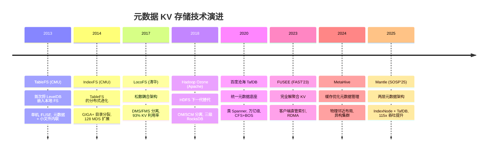

**TableFS (2013)** 是开山之作，证明了 LevelDB（LSM-tree）可以在单机上将元数据操作性能提升 1~10 倍。但它是单机方案，无法扩展。

**IndexFS (2014)** 将 TableFS 的理念扩展到分布式场景，通过 GIGA+ 目录分裂实现了多达 128 个 MDS 的水平扩展。但紧耦合的目录树结构导致 KV 存储利用率仅 18%。

**LocoFS (2017)** 对 IndexFS 进行了根本性的架构改造——松散耦合。通过将目录结构（DMS）和文件属性（FMS）分离，将 KV 利用率从 18% 提升到 93%，但引入了单点 DMS 瓶颈。

#### 第二阶段：云原生对象存储 (2006~2020) — 工业实践

这一阶段的核心问题是：**如何在超大规模（万亿级对象）下管理元数据？**

**S3/COS (2006~)** 采用了最极端的简化策略——扁平命名空间。放弃目录语义，对象名作为 Key，元数据作为 Value，天然适合 KV 存储。这一设计支撑了 AWS S3 的 400+ 万亿对象，但无法提供 POSIX 语义。

**百度沧海 TafDB (2020~)** 走了完全不同的路线——自研类 Spanner 分布式事务数据库作为统一底座。它同时支撑平坦 NS（BOS 对象存储）和层级 NS（CFS 文件存储），通过自定义分裂策略将跨分片事务优化为单分片事务。

**Hadoop Ozone (2018~)** 介于两者之间，将 HDFS 的全内存元数据方案替换为 RocksDB 持久化，突破了 10 亿文件的内存瓶颈，同时保留了 HDFS 兼容的层级命名空间。

#### 第三阶段：研究进阶 (2023-2025) — 极致优化

这一阶段的核心问题是：**在已有的 KV 元数据管理基础上，如何进一步榨取性能？**

**FUSEE (2023)** 从硬件层面入手，利用 RDMA + 内存解聚合彻底消除元数据服务器瓶颈，将索引元数据分发到客户端直接管理。吞吐提升 4.5 倍，但依赖昂贵的 RDMA 硬件。

**MetaHive (2024)** 从缓存局部性入手，通过物理邻近布局减少元数据检索的额外 I/O，是一种底层的、对上层透明的优化。

**Mantle (2025)** 综合了前面所有阶段的经验教训，提出了两层架构（IndexNode 缓存 + TafDB 持久化），在保证强一致性的同时实现了自适应扩展（小规模单机事务 ↔ 大规模分布式事务），是当前最先进的方案。

### 3.2 横向对比表

| 系统 | 年份 | 架构类型 | KV 引擎 | 核心创新 | 主要局限 |
|------|------|---------|---------|---------|---------|
| **TableFS** | 2013 | 单机 | LevelDB | 首次用 LSM-tree KV 管理 FS 元数据；小文件内联 | FUSE 开销；单机不可扩展；compaction 写放大 |
| **IndexFS** | 2014 | 分布式 (128 MDS) | LevelDB (per MDS) | GIGA+ 目录分裂；无状态客户端缓存；Bulk Insertion | KV 利用率仅 18%；rename 昂贵；中间件复杂 |
| **LocoFS** | 2017 | 分布式 (单 DMS + N FMS) | 自定义 KV | 松散耦合；DMS/FMS 分离；零序列化 | 单点 DMS 瓶颈；POSIX 语义放松 |
| **S3/COS** | 2006~ | 超大规模分布式 | DynamoDB / 内部 DB | 扁平命名空间；无限扩展；REST API | 无 POSIX 语义；List 操作慢；无原子目录操作 |
| **TafDB** | 2020~ | 分布式 (类 Spanner) | RocksDB + Multi-Raft | 统一底座（BOS+CFS+AFS）；自定义分裂优化 2PC→1PC | 极高实现复杂度；非开源；LSM 删除性能问题 |
| **Ozone** | 2018~ | 分布式 (OM + SCM + DN) | RocksDB (三级) | 突破 HDFS 10 亿文件限制；Container 粒度复制 | OM 准单点；元数据扩展性有限；项目成熟度 |
| **Mantle** | 2025 | 分布式两层 | TafDB (RocksDB) | IndexNode 缓存 + TafDB 持久；Delta Record；自适应架构 | 极高复杂度；缓存一致性；非开源 |
| **MetaHive** | 2024 | 可嵌入 | RocksDB | 缓存优化；物理邻近布局；零开销数据校验 | 研究性设计；修改存储布局侵入性强；不涉及 FS 语义 |
| **FUSEE** | 2023 | 分布式解聚合 | 内存 Hash Table | 客户端直管索引；RDMA；4.5x 吞吐 | 依赖 RDMA 硬件；纯内存不持久；客户端复杂 |

### 3.3 学术演进链分析

从 TableFS → IndexFS → LocoFS → Mantle，存在一条清晰的学术演进链：

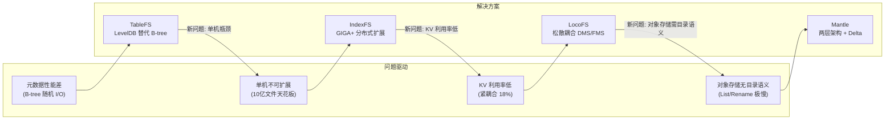

**第一步：TableFS → IndexFS（单机 → 分布式）**

TableFS 证明了 LSM-tree 可以大幅提升元数据性能，但单机方案在 HPC 场景下远远不够。IndexFS 的核心贡献是 GIGA+ 算法——一种增量式哈希分裂方案，使得大目录可以透明地分布到多个 MDS 上，客户端通过位图缓存分裂状态。然而，IndexFS 保留了 TableFS 的目录树结构，每次文件操作都需要多次 KV 读写来维护目录树的一致性。

**第二步：IndexFS → LocoFS（紧耦合 → 松散耦合）**

LocoFS 的核心洞察是：IndexFS 的低效（仅 18% KV 利用率）源于目录树结构的紧耦合。创建一个文件需要：
1. 查找父目录（1 次 KV 读）
2. 创建文件 inode（1 次 KV 写）
3. 在父目录中添加目录项（1 次 KV 写）
4. 更新父目录属性（mtime 等）（1 次 KV 读 + 写）

共 5 次 KV 操作，且步骤间有严格的依赖关系。LocoFS 通过将目录结构（DMS）和文件属性（FMS）分离，将步骤 2 直接路由到 FMS，步骤 4 延迟更新，关键路径缩短到 1~2 次 KV 操作。

**第三步：LocoFS → Mantle（文件系统 → 对象存储层级 NS）**

Mantle 面对的是一个全新的场景：对象存储需要层级命名空间。它综合了前面所有方案的优点：
- 从 TableFS/IndexFS 继承了 KV 存储管理元数据的核心理念
- 从 LocoFS 学习了松散耦合和延迟更新（Delta Record 是 LocoFS 延迟更新思想的正式化）
- 从 TafDB 获得了可扩展的持久化底座
- 创新性地引入了 IndexNode 缓存层，解决了长路径解析的延迟问题

---

## 4. 核心问题解答

### 4.1 为什么要用 KV 存储管理元数据？

#### 问题本质

传统文件系统（ext4、XFS、Btrfs）使用 **B-tree 或 B+ tree** 来管理元数据（inode 表、目录项）。这种数据结构在以下场景下效率不高：

- **大量小文件创建/删除：** 每次 create/unlink 都需要修改 B-tree 节点（就地更新），产生随机磁盘 I/O
- **高频元数据修改：** chmod/chown/utime 等操作需要读取 B-tree 节点 → 修改 → 写回，3 次 I/O
- **目录遍历：** B-tree 的叶子节点可能分散在磁盘各处，readdir 需要大量随机读取

#### KV 存储（LSM-tree）的核心优势

LSM-tree（Log-Structured Merge Tree）是 LevelDB/RocksDB 的核心数据结构，它将随机写入转换为顺序写入：

| 对比维度 | B-tree (ext4/XFS) | LSM-tree (RocksDB) | 差异 |
|---------|-------------------|--------------------|----|
| **写入模式** | 就地更新（random write） | 追加写入 MemTable → 刷盘为 SSTable（sequential write） | LSM 写入带宽高 3~10 倍 |
| **写入放大** | ~2x（更新 + journal） | ~10-30x（compaction） | B-tree 更低 |
| **读取放大** | ~1x（直接定位） | ~3-10x（需检查多层 SSTable） | B-tree 更低 |
| **空间放大** | ~1x | ~1.1-1.5x | B-tree 更紧凑 |
| **小写入聚合** | ❌ 每次写入都落盘 | ✅ MemTable 在内存中聚合多次写入 | LSM 批量写效率高 |
| **压缩率** | 一般 | 高（SSTable 可压缩） | LSM 可节省 30-50% 空间 |
| **并发写入** | 需要锁/WAL | MemTable 支持无锁并发 | LSM 更适合高并发 |

**定量数据（来自 TableFS 论文）：**
- 元数据密集型工作负载：LSM-tree 方案比 ext4 **快 1~10 倍**
- 100 万文件创建：TableFS ~120 秒 vs ext4 ~600 秒（提速 5 倍）
- 随机 stat 操作：TableFS 与 ext4 基本持平（LSM 的读放大与 B-tree 的定位能力抵消）

#### 为什么 LSM-tree 特别适合元数据？

1. **元数据操作以写入为主：** 文件创建、属性修改、目录更新等写操作占元数据 I/O 的 60%+，LSM 的顺序写入优势得以充分发挥
2. **元数据体积小：** 单个 inode 仅 ~100-200 字节，非常适合在 MemTable 中聚合
3. **目录遍历天然有序：** LSM-tree 的 SSTable 按 Key 有序排列，`parent_id` 前缀扫描自然高效
4. **批量操作友好：** WriteBatch 可以将 create 操作的多个 KV 写入（inode + dir_entry + 计数器更新）合并为一次原子写入

#### 与其他方案的对比

| 方案 | 适用场景 | 不适用场景 |
|------|---------|----------|
| **B-tree (ext4)** | 大文件顺序读写、低写入量 | 大量小文件、高频元数据修改 |
| **全内存 (HDFS NameNode)** | 极低延迟需求、文件数 <10 亿 | 大规模（内存不够）、持久化要求高 |
| **LSM-tree KV (RocksDB)** | 高频写入、大量小文件、需要持久化 | 随机读取密集（读放大）、写放大敏感 |
| **分布式事务 DB (TafDB/Spanner)** | 超大规模、强一致性、多租户 | 小规模单机场景（过度设计） |

**结论：** 对于 RucksFS 这类以 POSIX 操作为核心的文件系统，RocksDB（LSM-tree）是元数据管理的最佳选择。它在写入性能上大幅领先 B-tree，在持久化和空间效率上远优于全内存方案，实现复杂度也远低于分布式事务数据库。

### 4.2 元数据与数据分离的意义

#### 为什么要分离？

文件系统需要管理两种截然不同的数据：

| 维度 | 元数据 | 文件数据 |
|------|--------|---------|
| **体积** | 小（~100-200 字节/文件） | 大（KB ~ GB ~ TB） |
| **访问模式** | 随机读写为主（lookup, stat, chmod） | 顺序读写为主（read, write） |
| **一致性要求** | 极高（目录结构必须一致） | 中等（允许部分写入） |
| **操作频率** | 极高（每次文件访问前都需要元数据操作） | 中等（数据读写频率低于元数据操作） |
| **最佳存储引擎** | LSM-tree KV（写入优化） | 日志/块存储（大块顺序 I/O） |

将两者分离的核心收益：

#### 收益 1：独立优化

分离后，元数据引擎和数据引擎可以各自针对其访问模式进行深度优化：

- **元数据 → RocksDB：** 打开 Bloom Filter 加速点查询、使用前缀提取器加速目录遍历、调优 compaction 策略
- **数据 → Raw Disk/块存储：** 使用大块 I/O（4KB~1MB 对齐）、预分配空间减少碎片、可选压缩/纠删码

#### 收益 2：独立扩展

在分布式场景下，分离使得两者可以独立扩展：

- 元数据热点？→ 增加元数据服务器或缓存（IndexNode）
- 存储容量不足？→ 增加数据节点
- 无需两者同步扩展，避免资源浪费

#### 收益 3：故障隔离

- 数据节点故障不影响元数据操作（目录遍历、权限检查仍可继续）
- 元数据引擎 compaction 不影响数据读写吞吐

#### 性能收益量化

基于各系统的报告数据：

| 系统 | 分离设计 | 元数据性能提升 | 说明 |
|------|---------|--------------|------|
| TableFS | 元数据→LevelDB, 大文件→EXT4 | 1~10x vs ext4 | 小文件内联进一步提升 |
| Ozone | 元数据→RocksDB, 数据→Container | 突破 10 亿文件限制 | 从全内存改为持久化 |
| Mantle | 元数据→TafDB, 数据→纠删码块存储 | 115x 吞吐提升 | 加上 IndexNode 缓存 |

#### 代价

1. **关联一致性：** 元数据说文件存在，但数据可能尚未落盘（或反之）——需要额外的一致性协调
2. **间接寻址：** 读取文件需要先查元数据获取数据位置，再访问数据——多一次查询
3. **实现复杂度：** 需要设计 inode ID 作为关联键，保证两个引擎之间的引用完整性

**结论：** 对于 RucksFS，元数据/数据分离已经在设计中实现（RocksDB + RawDiskDataStore），这是正确的设计决策。核心关注点应该是 inode ID 作为关联键的一致性保证。

### 4.3 分布式 vs 单机：如何选择？

这是一个需要结合**项目定位**来回答的问题。让我们从各系统的经验教训出发分析：

#### 各系统的架构选择与其后果

| 系统 | 选择 | 驱动因素 | 后果 |
|------|------|---------|------|
| TableFS | 单机 | 学术原型，验证 KV 元数据的可行性 | 性能优异但无法扩展 |
| IndexFS | 分布式 (128 MDS) | HPC 场景需要数千节点并发 | 扩展性好但 KV 利用率仅 18% |
| LocoFS | 分布式 (单 DMS) | 优化 IndexFS 的 KV 利用率 | 利用率 93% 但 DMS 单点瓶颈 |
| HDFS | 单机 NameNode | 简单性优先 | 10 亿文件天花板 |
| Ozone | 分布式 (Raft HA) | 突破 HDFS 限制 | 复杂度大增，延迟变高 |
| TafDB | 超大规模分布式 | 万亿级对象的生产需求 | 工程量巨大（百人团队） |
| Mantle | 自适应 | 同时支撑小到大规模 | 最先进但也最复杂 |

#### RucksFS 的当前定位分析

RucksFS 当前是一个**课题/学术项目**，其核心特征：

1. **开发团队小**（个人或小团队）
2. **当前目标是 demo 模式**（单进程，不走 gRPC）
3. **已有 Client/Server 分离设计**（gRPC 预留）
4. **核心课题是"元数据 KV 存储的文件系统操作"**

#### 建议：先单机，后分布式

**短期选择：深耕单机。** 理由如下：

1. **TableFS 已经证明了单机 KV 元数据的巨大价值。** RucksFS 如果能在单机 RocksDB 上实现完整的 POSIX 语义并达到 TableFS 级别的性能提升，这本身就是有意义的成果。

2. **分布式的工程成本是单机的 10~100 倍。** TafDB 是百度百人团队的作品，IndexFS 也是 CMU 实验室多年的积累。小团队应该集中火力在核心创新上。

3. **RucksFS 已经预留了分布式扩展路径。** `MetadataStore`/`DataStore`/`DirectoryIndex` 三个 trait 的设计就是为了可替换实现。未来将 `RocksMetadataStore` 替换为 TiKV 实现、将 `RawDiskDataStore` 替换为 S3 实现，即可实现分布式扩展。

4. **单机优化的技术成果可以直接复用到分布式版本中。** IndexNode 缓存、Delta Record、Column Family 调优等技术，在单机和分布式环境下都适用。

### 4.4 仅优化元数据 KV 是否能大幅提升性能？

**答案：是的，但有条件。**

#### 定量依据

来自多个系统的实测数据：

| 场景 | 元数据 KV 优化后的提升 | 来源 |
|------|---------------------|------|
| 100 万文件创建 | **5x** faster than ext4 | TableFS |
| 元数据密集型工作负载 | **1~10x** improvement | TableFS |
| 128 MDS 集群 vs 单点 | **50~100x** throughput | IndexFS |
| 松散耦合 vs 紧耦合 | **5x** higher IOPS | LocoFS |
| IndexNode 缓存 + TafDB | **115x** throughput | Mantle |
| 完全解聚合 KV | **4.5x** vs semi-disaggregated | FUSEE |

#### "大幅提升"的条件

元数据 KV 优化的效果取决于**工作负载中元数据操作的占比**：

```
总性能提升 ≈ 元数据操作占比 × 元数据操作的加速比
```

| 工作负载类型 | 元数据操作占比 | 优化效果 |
|------------|-------------|---------|
| 大量小文件创建/删除（HPC 检查点） | >90% | ⭐⭐⭐⭐⭐ 极大提升 |
| 目录遍历密集（find, ls -R） | >80% | ⭐⭐⭐⭐ 显著提升 |
| 元数据 + 小文件混合读写 | ~60% | ⭐⭐⭐ 明显提升 |
| 大文件顺序读写（视频处理） | <20% | ⭐ 提升有限 |
| 流式写入（日志收集） | <10% | ⭐ 几乎无提升 |

#### RucksFS 的情况

RucksFS 作为通用文件系统，需要同时处理元数据和数据操作。仅优化元数据 KV **确实能显著提升**以下场景的性能：

1. **ls / find / stat 等元数据查询：** 这些操作 100% 是元数据操作，RocksDB 的 Bloom Filter 和前缀扫描可以大幅加速
2. **mkdir / create / unlink 等目录操作：** WriteBatch 原子写入 + LSM 顺序写入，比 ext4 的 B-tree 更新快很多
3. **权限检查（每次 open 前的 lookup + getattr）：** RocksDB 点查询 + Bloom Filter 非常高效

但对于大文件的 read/write 操作，性能主要取决于 `DataStore`（RawDiskDataStore）的效率，元数据优化帮助有限。

**结论：** 仅优化元数据 KV 确实能大幅提升元数据密集型场景的性能（1~10 倍），这对于文件系统的整体体验有显著改善（因为几乎所有操作都涉及元数据）。但如果目标是大文件吞吐，则需要同时优化数据通路。

---

## 5. RucksFS 项目发展建议

### 5.1 当前架构对标分析

#### RucksFS 最接近哪个系统？

**RucksFS 当前架构最接近 TableFS**，具体对标如下：

| 维度 | TableFS | RucksFS | 差异 |
|------|---------|---------|------|
| **元数据引擎** | LevelDB (LSM-tree) | RocksDB (LSM-tree) | RucksDB 更先进（多 CF、WriteBatch、Bloom Filter） |
| **数据存储** | EXT4 大文件路径 | RawDiskDataStore (裸文件) | RucksFS 更简洁（不依赖宿主 FS） |
| **小文件处理** | 内联到 LevelDB | 全部走 DataStore | TableFS 更高效（小文件一次 I/O） |
| **FUSE 层** | C++ FUSE | Rust fuser | RucksFS 更安全 |
| **架构** | 单进程 | Client/Server 分离（gRPC） | RucksFS 预留了分布式扩展路径 |
| **事务** | LevelDB WriteBatch | RocksDB WriteBatch | 功能一致 |
| **分布式** | ❌ | ❌（当前仅 demo 模式） | 均为单机 |
| **IndexNode 缓存** | ❌ | ❌ | 均无 |
| **Delta Record** | ❌ | ❌ | 均无 |

#### 与 Mantle 的差距

如果以 Mantle 作为"理想目标"，RucksFS 的差距在于：

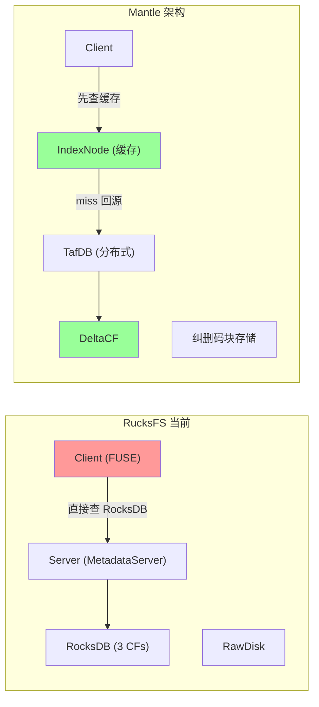

**核心差距（按优先级排序）：**

1. **无 IndexNode 缓存层** — 每次 lookup/getattr 都直接查 RocksDB，无法利用局部性
2. **无 Delta Record** — 每次目录属性更新都是 read-modify-write，高并发下产生竞争
3. **无小文件内联** — 小文件（<4KB）的元数据和数据需要两次独立 I/O
4. **单机不可扩展** — RocksDB 是单实例，无分片/多副本
5. **无 ACL/权限缓存** — 权限检查每次都需要读取 RocksDB

### 5.2 发展路径建议

#### 路径 A：深耕单机性能（推荐 ✅）

**定位：** 做一个"现代版 TableFS"——在单机 RocksDB 上实现完整 POSIX 语义，并通过一系列优化达到或超越 TableFS 的性能水平。

**核心创新点：**
1. **IndexNode 内存缓存**：在 `MetadataServer` 中加入 LRU/ARC 缓存层，缓存热点 inode 属性和目录项
2. **Delta Record 机制**：引入 DeltaCF，将目录属性更新（mtime、子项数量）从 read-modify-write 改为追加写入
3. **小文件内联**：文件大小 < threshold（如 4KB）时，将文件内容直接存入 `inodes` CF 的 Value 中
4. **RocksDB 深度调优**：Bloom Filter、前缀提取器、compaction 策略、Block Cache 大小等
5. **内核模块替代 FUSE**：消除用户态/内核态切换开销（长期目标）

**优势：**
- 工程量可控（个人/小团队可执行）
- 每项优化都有明确的学术参考和性能预期
- 技术成果可发表论文（如 "RucksFS: A Rust-based TableFS with IndexNode Caching and Delta Records"）
- 所有优化在未来转向分布式时可直接复用

**劣势：**
- 单机方案在工业界的适用性有限
- 无法解决超大规模（>10 亿文件）的扩展性问题

#### 路径 B：走向分布式

**定位：** 做一个"简化版 Ozone/IndexFS"——在 RucksFS 的 trait 抽象基础上，引入分布式元数据扩展。

**实现路线：**
1. 将 `MetadataStore` 的 RocksDB 实现替换为 TiKV（开源分布式 KV，类 Spanner 事务）
2. 将 `DataStore` 替换为 S3/MinIO 接口
3. 实现简化版 GIGA+ 目录分裂
4. 引入 Raft 共识确保元数据高可用

**优势：**
- 更接近工业级系统，适用于更广泛的场景
- 可以支撑十亿级文件规模

**劣势：**
- 工程量巨大（预计 6~12 个月全职开发）
- 分布式事务的正确性验证极其困难
- 需要处理分布式一致性、故障恢复、负载均衡等复杂问题
- 可能与 TiKV 等现有项目的工作重叠

#### 路径对比

| 维度 | 路径 A（深耕单机） | 路径 B（走向分布式） |
|------|------------------|-------------------|
| **工程量** | 中等（3-6 个月） | 大（12+ 个月） |
| **创新性** | 中高（Rust + 多项优化组合） | 中（已有很多分布式 FS） |
| **学术价值** | 高（可发表系统论文） | 高（分布式方向更受关注） |
| **工业适用性** | 中（单机场景） | 高（分布式场景） |
| **风险** | 低 | 高（可能做不完） |
| **团队要求** | 1-2 人 | 3-5 人 |

### 5.3 短期与中长期行动计划

#### 短期（1-3 个月）：完善基础 + 性能基线

| 优先级 | 任务 | 预期收益 | 难度 |
|-------|------|---------|------|
| P0 | **验证当前架构的正确性**：完善测试用例，确保所有 15 个 POSIX 操作语义正确 | 建立可靠的基础 | ⭐⭐ |
| P0 | **建立性能基线**：使用 filebench/mdtest 对当前实现进行全面基准测试 | 量化后续优化的效果 | ⭐⭐ |
| P1 | **实现 IndexNode 缓存层**：在 `MetadataServer` 中加入 LRU 缓存（`DashMap` + eviction） | lookup/getattr 减少 50%+ RocksDB 查询 | ⭐⭐⭐ |
| P1 | **RocksDB 调优**：启用 Bloom Filter、配置前缀提取器、调整 Block Cache 大小 | 点查询提速 2~3 倍 | ⭐⭐ |
| P2 | **小文件内联**：在 `InodeValue` 中增加 `inline_data` 字段，小文件内容直接存入 `inodes` CF | 小文件 I/O 减少 50% | ⭐⭐⭐ |

#### 中长期（3-12 个月）：核心优化 + 论文产出

| 优先级 | 任务 | 预期收益 | 难度 |
|-------|------|---------|------|
| P0 | **实现 Delta Record**：引入 `delta_entries` CF，目录属性增量更新 + 后台合并 | 消除高并发目录更新竞争 | ⭐⭐⭐⭐ |
| P1 | **线程安全审计**：检查所有共享状态的并发访问，确保无数据竞争 | 保证多线程 FUSE 的正确性 | ⭐⭐⭐ |
| P1 | **FUSE 替代方案调研**：评估 FUSE、io_uring、内核模块等接入方式的性能差异 | 为后续优化提供决策依据 | ⭐⭐ |
| P2 | **Client 端引入缓存**：在 `FuseClient` 中缓存最近的 lookup/getattr 结果 | 减少 gRPC 往返，降低延迟 | ⭐⭐⭐ |
| P2 | **性能论文**：撰写系统论文，对比 RucksFS vs ext4/XFS 在元数据工作负载下的表现 | 学术产出 | ⭐⭐⭐⭐ |
| P3 | **探索内核模块方案**：如果 FUSE 成为性能瓶颈，实现 Rust 内核模块版本 | 消除用户态开销 | ⭐⭐⭐⭐⭐ |

#### 关键里程碑

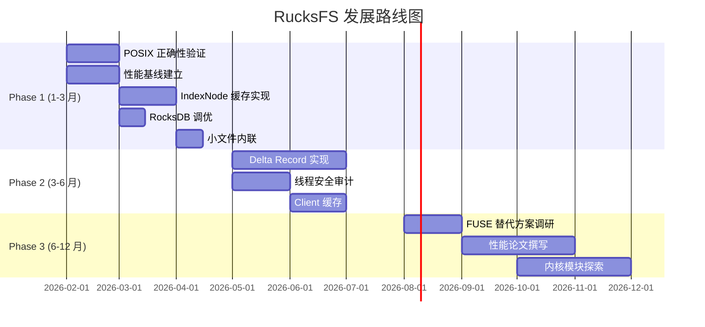

---

## 参考文献

### 学术论文

1. **[TableFS]** Kai Ren, Garth Gibson. *TABLEFS: Enhancing Metadata Efficiency in the Local File System.* USENIX ATC 2013. CMU-PDL-12-110.

2. **[IndexFS]** Kai Ren, Qing Zheng, Swapnil Patil, Garth Gibson. *IndexFS: Scaling File System Metadata Performance with Stateless Caching and Bulk Insertion.* SC'14 (Best Paper Award). CMU-PDL-14-103.

3. **[LocoFS]** Siyang Li, Youyou Lu, Jiwu Shu, Yang Hu, Tao Li. *LocoFS: A Loosely-Coupled Metadata Service for Distributed File Systems.* SC'17. Tsinghua University.

4. **[Mantle]** 百度沧海·存储团队. *Mantle: A Scalable Hierarchical Namespace for Object Storage.* SOSP 2025.

5. **[MetaHive]** *MetaHive: A Cache-Optimized Metadata Management for Heterogeneous Key-Value Stores.* arXiv:2407.19090, 2024.

6. **[FUSEE]** Jiacheng Shen et al. *FUSEE: A Fully Memory-Disaggregated Key-Value Store.* USENIX FAST 2023.

7. **[CFS]** 百度. *如何将千亿文件放进一个文件系统.* EuroSys 2023.

### 工业系统文档

8. **[AWS S3]** Amazon Web Services. *Amazon S3 Developer Guide.* https://docs.aws.amazon.com/AmazonS3/latest/dev/

9. **[TafDB]** 百度智能云. *打造无限扩展的云存储系统，元数据存储底座的设计和实践.* https://cloud.baidu.com/article/298957

10. **[Ozone]** Apache Software Foundation. *Apache Ozone Architecture.* https://ozone.apache.org/docs/

11. **[RocksDB]** Facebook. *RocksDB Wiki.* https://github.com/facebook/rocksdb/wiki

### 开源实现

12. **[FUSEE-FS]** https://github.com/ztorchan/FUSEE-FS — FUSEE 的文件系统扩展实现

13. **[IndexFS Source]** https://www.pdl.cmu.edu/indexfs/ — CMU IndexFS 开源代码

### 补充参考

14. **[Tectonic]** Pan et al. *Facebook's Tectonic Filesystem: Efficiency from Exascale.* FAST 2021.

15. **[LevelDB]** Google. *LevelDB: A Fast Key-Value Storage Library.* https://github.com/google/leveldb

16. **[LSM-tree]** Patrick O'Neil et al. *The Log-Structured Merge-Tree (LSM-Tree).* Acta Informatica, 1996.
